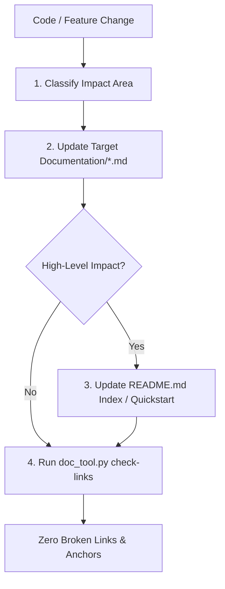

# Project Documentation Sync (`project-doc-sync`)

This skill defines the process, structure, and tooling for keeping the MADTOM documentation continuously up to date whenever changes are made to the codebase.

## 1. Documentation Architecture

The MADTOM documentation follows a strict two-tier architecture:
- **`README.md` (Top-Level Entry Point)**:
  - Clean, scannable overview of the project.
  - Quick-start instructions for building, running, and publishing.
  - Direct links into detailed documentation guides.
  - Minimal deep technical detail; delegates to `Documentation/`.
- **`Documentation/*.md` (Topic-Specific Reference Manuals)**:
  - Comprehensive, deep-dive reference manuals for specific subsystems.
  - All deep explanations, full CLI flag tables, configuration schemas, Mermaid architectural diagrams, and protocol specifications live here.

### Standard Documentation Modules

| Documentation File | Scope & Content |
|---|---|
| [`Documentation/cli-and-scripts.md`](Documentation/cli-and-scripts.md) | Exhaustive parameter tables, syntax, options, and execution examples for all build/publish/deploy scripts and compiled binaries (`madtom-daemon`, `madtom-collector`, `MADTOM.Console`, `MADTOM.Plugins.Telemetry.App`). |
| [`Documentation/ui-and-config.md`](Documentation/ui-and-config.md) | User interface walkthrough, graph scopes (1m to 24h + custom time picker), LTTB downsampling, and persistent configuration files (`graphs.json`, `collectors.json`) in `~/.local/share/MADTOM/`. |
| [`Documentation/deployment-and-services.md`](Documentation/deployment-and-services.md) | Remote server deployments via SSH (`deploy.sh`), architecture auto-detection, production systemd unit templates, security sandboxing, and service journal troubleshooting. |
| [`Documentation/architecture-and-protocols.md`](Documentation/architecture-and-protocols.md) | Transport modes (Push, Pull, Reverse-Push), WAL spooling and crash-resilient buffer management, Pebble TSDB key schema and query paths, and TWAMP Light (RFC 5357) network latency probing. |

---

## 2. Documentation Sync Protocol

Whenever code, configuration, scripts, or features are modified in MADTOM, follow this 4-step sync protocol:



### Step 1: Classify the Impact Area
Identify which subsystem is affected by the changes:
- **CLI flag, script option, or binary argument change**: Target `Documentation/cli-and-scripts.md`.
- **UI control, time scope, or configuration setting (`graphs.json`, `collectors.json`)**: Target `Documentation/ui-and-config.md`.
- **Deployment workflow, SSH script, or systemd service unit**: Target `Documentation/deployment-and-services.md`.
- **gRPC protocol, WAL buffer, TSDB storage schema, or network probe**: Target `Documentation/architecture-and-protocols.md`.
- **New major feature or tool**: Create a new topic guide in `Documentation/` or add a new major section.

### Step 2: Update Detailed Guide in `Documentation/*.md`
- Document all new or modified flags, parameters, options, or behaviors.
- Maintain consistent markdown tables for arguments and options.
- Provide practical copy-pasteable command examples.
- Use GitHub callout alerts (`> [!NOTE]`, `> [!TIP]`, `> [!IMPORTANT]`) for critical behavior nuances (e.g. timezone handling, sandboxing, fallback paths).
- Update the file's local Table of Contents to include any new section headings.

### Step 3: Update `README.md`
- If a new script, binary, or top-level workflow was introduced, update the Quick Start section in `README.md`.
- Ensure the Documentation Index table in `README.md` links to the relevant guides.
- Keep `README.md` concise—always offload detailed explanations to relative links in `Documentation/*.md`.

### Step 4: Validate Links & Anchors
Run the validation script from the repository root:
```bash
./.agents/skills/project-doc-sync/scripts/doc_tool.py check-links
```

The script verifies:
1. All relative file links exist.
2. All anchor links (`#heading-slug`) match an actual heading in the target markdown file using GitHub Flavored Markdown (GFM) slugging rules.
3. No broken internal links remain.

If errors are found, correct the heading slugs or links until `check-links` passes with `0` errors.

To inspect documentation volume and headings:
```bash
./.agents/skills/project-doc-sync/scripts/doc_tool.py summary
```

---

## 3. Link & Anchor Formatting Rules

To maintain cross-platform and GitHub-compatible links:
1. **Relative Paths**: Always use relative paths from the referencing file (e.g. `[CLI Guide](Documentation/cli-and-scripts.md)` from root, or `[Deploy Script](../deploy.sh)` from within `Documentation/`). Never use hardcoded absolute system paths.
2. **Anchor Slugs**:
   - GFM downcases all characters.
   - Punctuation (periods, backticks, slashes, em-dashes `—`) is removed.
   - Spaces become hyphens (`-`).
   - Consecutive spaces (e.g. around removed characters like ` & ` or ` — `) produce multiple hyphens (`--`).
   - Example: `### 1. `./build.sh` — Unified Project Build` -> `#1-buildsh--unified-project-build`.
   - Example: `## Configuration & Persistent Storage` -> `#configuration--persistent-storage`.

