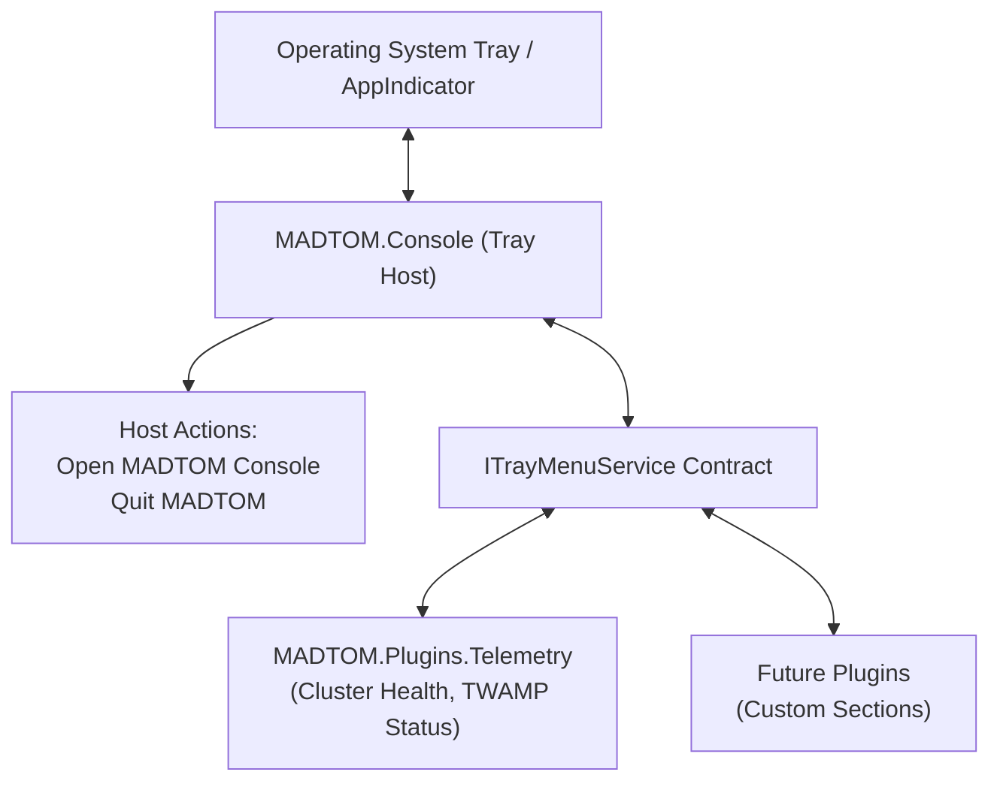

# MADTOM Console: UI & Theming Guide

This guide covers the **MADTOM Console** desktop host shell, dynamic layout scaling, system tray integration, runtime theme engine, lexicon dialect localization, and persistent user preferences.

---

## Table of Contents

- [Desktop UI Shell Overview](#desktop-ui-shell-overview)
  - [Executable & Launching](#executable--launching)
  - [Interactive Resizable Sidebars](#interactive-resizable-sidebars)
  - [Symmetrically Resizable Centered Modals](#symmetrically-resizable-centered-modals)
  - [Modal Escape Key Navigation](#modal-escape-key-navigation)
- [UI Scaling & Display Multiplier](#ui-scaling--display-multiplier)
- [System Tray & Background Execution](#system-tray--background-execution)
  - [Decoupled Architecture](#decoupled-architecture)
  - [Tray Behavior Preferences](#tray-behavior-preferences)
  - [Plugin Status Sections](#plugin-status-sections)
- [Theming & Display Contrast Profiles](#theming--display-contrast-profiles)
  - [Accessing Theme Settings](#accessing-theme-settings)
  - [14 Built-in Palettes](#14-built-in-palettes)
  - [Dynamic Theme Loading & File Watching](#dynamic-theme-loading--file-watching)
  - [Custom Theme Schema (YAML & JSON)](#custom-theme-schema-yaml--json)
- [Lexicon Dialect Localization](#lexicon-dialect-localization)
  - [Community Dialect Packs](#community-dialect-packs)
- [Host Configuration & Persistent Storage](#host-configuration--persistent-storage)
  - [Settings File Path](#settings-file-path)
  - [Schema (`settings.json`)](#schema-settingsjson)

---

## Desktop UI Shell Overview

MADTOM Console is a high-performance cross-platform desktop application written in **C# / .NET 10** using **Avalonia UI**. It acts as the extensible host shell for modular MADTOM plugins.

### Executable & Launching

- **Executable**: `MADTOM.Console` (packaged in `MADTOM_DOTNET/publish/{OS_arch}/MADTOM.Console/MADTOM.Console`)
- **Direct Run**:
  ```bash
  # Launch the desktop console
  dotnet run --project MADTOM_DOTNET/src/Host/MADTOM.Console/MADTOM.Console.csproj
  ```

### Interactive Resizable Sidebars

The desktop shell supports interactive, draggable splitters for navigation and secondary drawers:
- Left-click and drag the vertical border divider between the navigation rail/sidebar and main view area.
- Width changes are reactive and clamp to minimum readable widths to prevent UI collapse.

### Symmetrically Resizable Centered Modals

All major dialogs and configuration windows in MADTOM Console use a centralized `CenteredDialogResizer` layout pattern:
- Modals anchor dynamically to the center of the application window.
- Dragging any edge or corner symmetrically adjusts dialog dimensions while preserving viewport centering.
- Minimum and maximum constraints guard against off-screen placement regardless of desktop scale.

### Modal Escape Key Navigation

Every overlay modal implements top-level `KeyDown` interception:
- Pressing `Escape` on an open modal immediately dismisses the active modal dialog without saving uncommitted drafts.
- Background focus safely restores to the underlying host or plugin view without keyboard focus traps.

---

## UI Scaling & Display Multiplier

MADTOM Console features an app-wide layout scaling engine powered by Avalonia's `LayoutTransformControl` and `ScaleTransform`:

- **Dynamic Multiplier**: Scales all interface elements, typography, dialogs, and embedded plugin canvases from **10% (0.1×) up to 1000% (10.0×)** with pixel-accurate layout recalculation.
- **Settings Flyout**: Accessible via the gear icon (**⚙**) on the top-left header bar.
  - **Live Scale Readout**: Displays current percentage (e.g. `100% (1.0x)`).
  - **Smooth Slider**: Continuous adjustment from 10% to 1000% with tick markers.
  - **Quick Preset Chips**: Fast one-click jumps to `50%`, `75%`, `100%`, `150%`, and `200%`.
  - **Reset Button**: One-click restoration back to default 100% scale.
- **Persistence**: Saved to `UiScalePercent` in `~/.local/share/MADTOM/settings.json` and restored automatically on launch.

---

## System Tray & Background Execution

MADTOM Console includes native system tray integration designed for 24/7 background operation:



### Decoupled Architecture

- **Host Ownership**: `MADTOM.Console` owns the tray icon lifecycle, OS tray communication, window visibility state, and top-level host menu actions (**Open MADTOM Console** and **Quit MADTOM**).
- **Service Contract**: Plugins dynamically register contextual status sections into the tray via the host's `ITrayMenuService` contract without hardcoding UI dependencies into the host.
- **Plugin Section Attribution**: Each registered plugin section is automatically prefaced with a compact, non-intrusive header (`— {PluginName} —`) rendered in native muted/disabled color to cleanly attribute ownership across multiple loaded plugins.

### Tray Behavior Preferences

Operators configure window close/minimize behavior in the Console Settings flyout via a dropdown:

| Option | Behavior |
|---|---|
| **Standard Window Behavior** | Clicking `X` terminates the application; minimize button minimizes to taskbar. |
| **Minimize to Tray** | Clicking `_` (minimize) hides the window to the system tray; `X` closes the app. |
| **Close to Tray** | Clicking `X` (close) hides the window to the system tray; application continues running in background. |

### Plugin Status Sections

When a plugin (such as `MADTOM.Plugins.Telemetry`) attaches to the console:
- It contributes live cluster health, active alerts, and network telemetry directly into its designated section of the tray menu.
- Clicking tray menu items can restore the window and navigate directly to the relevant view.

---

## Theming & Display Contrast Profiles

MADTOM Console includes a comprehensive runtime theming engine that supports instant hot reloading and dynamic file watching for custom themes.

### Accessing Theme Settings

1. Click the gear icon (**⚙**) on the top-left navigation bar.
2. Select the **Themes** dropdown.
3. Choose from built-in themes or drop custom theme files into `~/.local/share/MADTOM/themes/`.

### 14 Built-in Palettes

The console ships with 14 handcrafted themes categorized by lighting and contrast:

| Theme Name | Style / Purpose | Base Tone |
|---|---|---|
| **Default Dark** | Default deep slate UI with clean contrast | `#121417` |
| **Neon Glass** | Vibrant cyberpunk cyan and magenta accents | `#0d1117` |
| **Cyberpunk High Contrast**| Ultra-saturated neon yellow/cyan for high-glare environments | `#000000` |
| **High Contrast** | Accessibility-focused black/white high-visibility palette | `#000000` |
| **Solarized Dark** | Classic low-contrast Ethan Schoonover palette | `#002b36` |
| **Simple Purple Dark** | Elegant muted indigo and violet tones | `#1a1625` |
| **Anti-Bleed Grey** | Neutral matte grey eliminating eye strain in dark rooms | `#1e1e1e` |
| **TFT Amber Terminal** | Retro monochrome phosphor amber CRT display | `#120c02` |
| **Delulu** | Soft pastel aesthetic with lavender and blush tones | `#231e2b` |
| **Minimal Mono** | Stark greyscale typography with zero color noise | `#181818` |
| **Paper White** | Warm sepia daytime document reading palette | `#fbf8f2` |
| **Pure Light** | Clean daylight minimal white interface | `#ffffff` |
| **Simple Purple Light** | Soft daylight violet and orchid interface | `#f6f4fa` |
| **Lavender** | Calming floral daytime palette with muted accents | `#f3f0f7` |

### Dynamic Theme Loading & File Watching

MADTOM Console automatically watches `~/.local/share/MADTOM/themes/` at runtime:
- Dropping a `.json` or `.yaml` theme file into the folder immediately registers it in the dropdown.
- Editing an active theme file updates the UI instantly without restarting the application.
- Invalid syntax is rejected safely in memory without crashing the console.

### Custom Theme Schema (YAML & JSON)

Custom themes define color resources for the application canvas, sidebars, borders, cards, and text hierarchy.

#### YAML Schema Example (`~/.local/share/MADTOM/themes/custom-theme.yaml`)

```yaml
id: custom-theme
name: Custom Theme
isDark: true
colors:
  Background: "#101216"
  BackgroundSecondary: "#161920"
  Surface: "#1d212a"
  SurfaceElevated: "#242934"
  Border: "#2e3442"
  TextPrimary: "#e6edf3"
  TextSecondary: "#8b949e"
  TextMuted: "#484f58"
  Accent: "#58a6ff"
  AccentHover: "#79b8ff"
  Success: "#3fb950"
  Warning: "#d29922"
  Error: "#f85149"
```

#### JSON Schema Example (`~/.local/share/MADTOM/themes/custom-theme.json`)

```json
{
  "id": "custom-theme",
  "name": "Custom Theme",
  "isDark": true,
  "colors": {
    "Background": "#101216",
    "BackgroundSecondary": "#161920",
    "Surface": "#1d212a",
    "SurfaceElevated": "#242934",
    "Border": "#2e3442",
    "TextPrimary": "#e6edf3",
    "TextSecondary": "#8b949e",
    "TextMuted": "#484f58",
    "Accent": "#58a6ff",
    "AccentHover": "#79b8ff",
    "Success": "#3fb950",
    "Warning": "#d29922",
    "Error": "#f85149"
  }
}
```

---

## Lexicon Dialect Localization

MADTOM Console provides a playful and flexible terminology customization system called the **Lexicon Engine**:

- **Built-in Packs**:
  - **Standard / Enterprise**: Professional infrastructure terms (`Nodes`, `Metrics`, `Collectors`, `Status`).
  - **Goose**: Waterfowl dialect (`Flock`, `Honk Health`, `Breadcrumbs`).
  - **Feline**: Cat behavior terminology (`Litter`, `Purr Rate`, `Scratching Post`).
  - **Cyberpunk**: High-tech dystopian lingo (`Decks`, `ICE`, `Synapse Load`).
- **Dynamic Updates**: Switching dialect packs instantly updates all registered view labels via Avalonia's `LocExtension` markup without requiring an application restart.

### Community Dialect Packs

Place custom `.json` lexicon packs into `~/.local/share/MADTOM/lexicons/` to add new community terminology sets.

---

## Host Configuration & Persistent Storage

### Settings File Path

All host-level preferences persist to disk under the user's standard XDG data directory:
```bash
~/.local/share/MADTOM/settings.json
```

### Schema (`settings.json`)

```json
{
  "ThemeId": "default-dark",
  "UiScalePercent": 100.0,
  "TrayBehavior": "MinimizeToTray",
  "LexiconPackId": "goose",
  "WindowWidth": 1400,
  "WindowHeight": 900,
  "IsMaximized": false
}
```

For information on developing and integrating plugins with MADTOM Console, see the [Plugin Architecture Guide](plugin-architecture.md).
