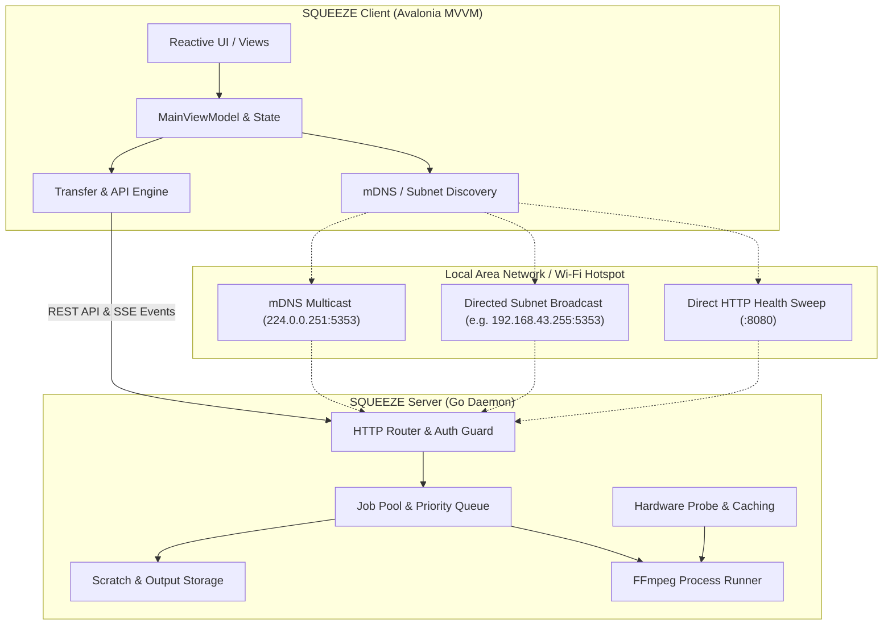
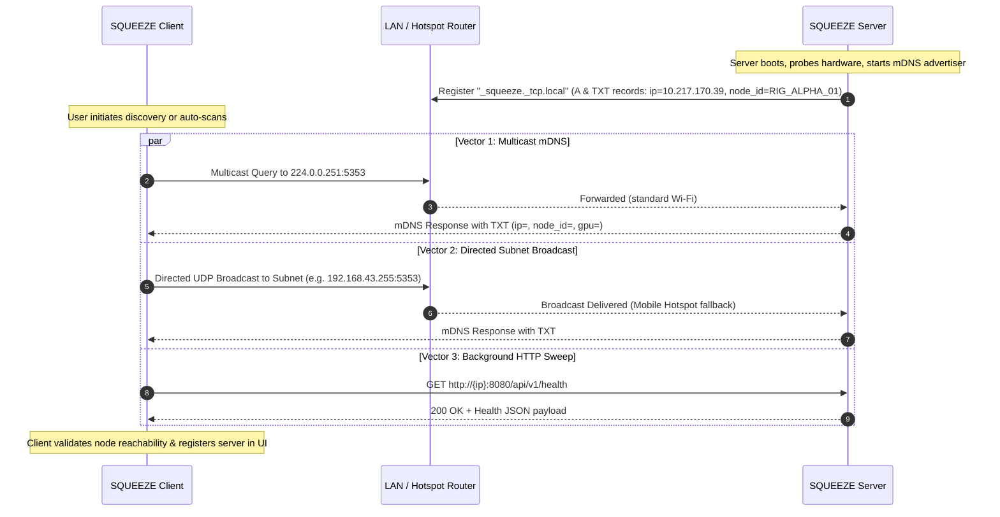
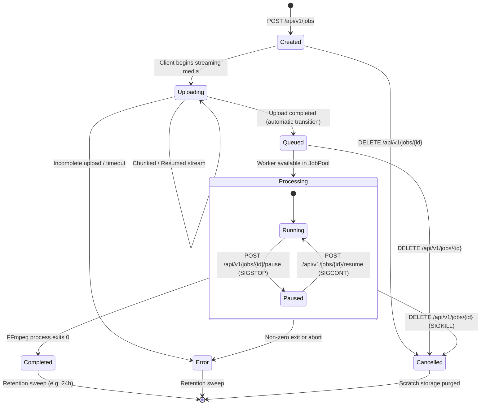
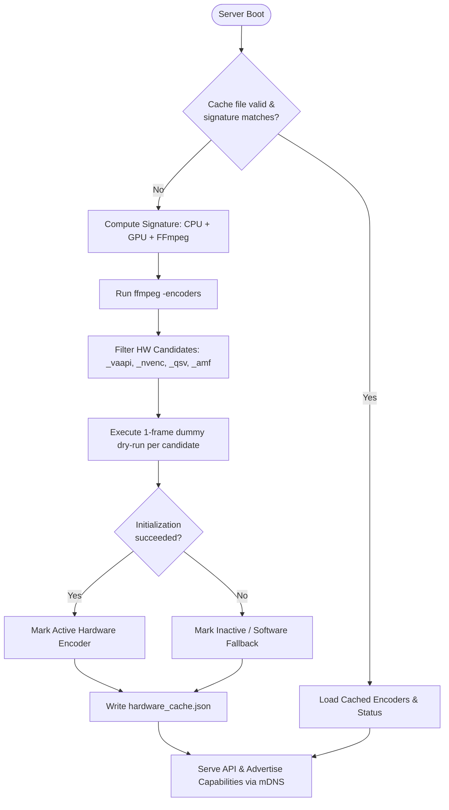

# SQUEEZE System Architecture

This document details the architectural design, network topology, discovery mechanics, and lifecycle state machines of SQUEEZE.

---

## 1. System Topology & Component Overview

SQUEEZE is composed of two primary subsystems:
1. **`SQUEEZE_SERVER`**: A lightweight Go daemon orchestrating FFmpeg encoding pipelines, hardware discovery, job queue management, and chunked streaming transfers.
2. **`SQUEEZE_UI`**: A cross-platform Avalonia MVVM application targeting desktop (.NET 10 on Linux/macOS/Windows) and mobile (Android).

---

## 2. Network Discovery Architecture

Zero-configuration discovery operates across heterogeneous networks, including enterprise LANs, home Wi-Fi routers, and Android mobile hotspots (which frequently drop standard multicast packets).

### Multi-Vector Discovery Protocol

### Discovery Safety & RFC 1918 Address Filtering
- **Private IP Validation**: Cellular gateway/carrier addresses (e.g. `192.0.0.1`, `192.0.0.4` generated by CLAT / 464XLAT) and point-to-point tunnels (`net.FlagPointToPoint`) are strictly ignored.
- **Outbound IP Priority**: The server determines its primary private IPv4 via UDP routing table lookup (`net.DialUDP("udp4", nil, 8.8.8.8:80)`) and advertises this primary address in TXT records (`ip=...`).
- **Health Verification Probe**: Before presenting any node in the client UI, the client performs an HTTP handshake against `/api/v1/health`.

---

## 3. Job Lifecycle & State Machine

Every encode job transitions through strict deterministic states:

---

## 4. Hardware Acceleration & Encoder Probing

On startup, `SQUEEZE_SERVER` probes the physical host and caches verified hardware encoders.

---

## 5. Client MVVM Reactive Architecture

The client UI is developed using [Avalonia UI](https://avaloniaui.net/) with compiled bindings and thread marshaling:
- **`Dispatcher.UIThread` Enforcement**: All asynchronous network transfers, mDNS event emissions, and SSE event handlers marshal property changes to the UI thread.
- **Responsive Adaptive Breakpoints**: Automatically adapts between widescreen desktop multi-column layouts and compact single-column mobile viewports via collapsible drawers and sidebars.
- **Storage Staging**: On Android, content URIs are safely staged to application cache storage (`Context.CacheDir`) before transcode initiation.

