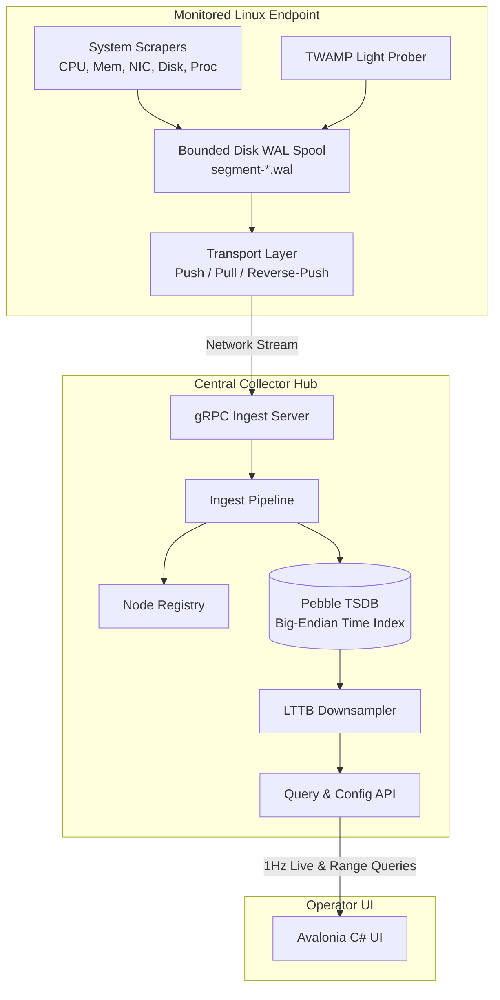

# Architecture & Protocols Reference

This document provides a technical brief on the internal architecture, transport topologies, storage mechanisms, and protocols powering MADTOM.

---

## Table of Contents

- [Architecture \& Protocols Reference](#architecture--protocols-reference)
  - [Table of Contents](#table-of-contents)
  - [High-Level Architecture](#high-level-architecture)
  - [Connection \& Ingestion Topologies](#connection--ingestion-topologies)
    - [Push Mode](#push-mode)
    - [Pull Mode](#pull-mode)
    - [Reverse-Push Mode](#reverse-push-mode)
    - [Live Subscriber Delivery](#live-subscriber-delivery)
  - [Durable Disk Spooling (WAL Engine)](#durable-disk-spooling-wal-engine)
  - [Client Cache and Response Compression](#client-cache-and-response-compression)
    - [Write-Ahead Log Mechanics](#write-ahead-log-mechanics)
    - [Bounded Quotas \& Eviction](#bounded-quotas--eviction)
    - [Optional Zstandard Compression](#optional-zstandard-compression)
  - [Storage Engine (CockroachDB Pebble TSDB)](#storage-engine-cockroachdb-pebble-tsdb)
    - [Key-Value Layout](#key-value-layout)
    - [Range Scans \& Prefixes](#range-scans--prefixes)
  - [TWAMP Light Latency Measurement (RFC 5357)](#twamp-light-latency-measurement-rfc-5357)
    - [Packet Structure \& Timestamping](#packet-structure--timestamping)
    - [One-Way vs. Round-Trip Calculation](#one-way-vs-round-trip-calculation)
  - [3-Tier Metric Opt-In System \& Data Model](#3-tier-metric-opt-in-system--data-model)
    - [Opt-In Operating Modes](#opt-in-operating-modes)
    - [Swap \& Multi-Device ZRAM Storage](#swap--multi-device-zram-storage)
    - [Per-Core CPU Visualization](#per-core-cpu-visualization)

---

## High-Level Architecture

MADTOM separates telemetry collection on remote endpoints from aggregation, querying, and storage.



---

## Connection & Ingestion Topologies

MADTOM supports three transport configurations to accommodate diverse network environments:

| Pattern | Daemon Mode | Collector Mode | Typical Deployment Scenario |
|---|---|---|---|
| **Push** | `-mode push -collector IP:50051` | Default listening port (`50051`) | Standard internal networks with direct outbound route to the collector. |
| **Pull** | `-mode pull -listen-port 50052` | `-pull-targets id@IP:50052` | Internal servers where the collector actively polls nodes at 1Hz. |
| **Reverse-Push** | `-mode reverse-push -listen-port 50052` | `-reverse-push-targets id@IP:50052` | Remote nodes behind NAT/firewalls where the collector can dial in. |

### Push Mode
- Daemon establishes an outbound gRPC stream to the collector's port `50051`.
- Daemon streams batches of samples; collector acknowledges after syncing to Pebble TSDB.

### Pull Mode
- Daemon binds to port `50052`.
- Collector's `PullScraper` issues periodic gRPC `PollTelemetry` requests (default: 1-second interval) to pull buffered samples.
- Each cycle drains at most 100 batches, stopping on an empty batch or when the newest successfully ingested sample is less than one scrape interval old. Freshness uses decoded ingestion metadata for both raw and zstd payloads, including batches whose samples arrive out of timestamp order. Decoding happens once; failed ingestion does not advance the acknowledgement cursor. Each RPC has its own five-second deadline.

### Reverse-Push Mode
- Daemon binds to port `50052` in passive listening mode.
- Collector dials the remote daemon. Once the TCP channel is established, the daemon streams telemetry batches **outbound** across the established stream to the collector.

Daemon process sampling keeps a heap of up to `NodeConfig.process_snapshot_limit` individual processes (1–1,000; omitted/zero defaults to 1,000), ranked by CPU, then resident memory (PID breaks ties). It still reads all process counters to find leaders and maintain CPU baselines, but reads UID/status and creates protobuf records only for retained candidates. The configurable snapshot count is separate from `top_n_processes` (1–10, default 5), which limits per-sample name groups persisted in Collector TSDB. The client can show additional process history from its session cache. Neither setting promises complete per-name totals beyond the PID snapshot cap. Swap and zram device probes run independently when their respective categories are enabled. A disabled network category with only OFF overrides skips the network probe entirely.

Historical range queries retain at most the requested point budget using absolute-time endpoint/extrema buckets while scanning Pebble. Sparse ranges remain unchanged. The range API accepts zero for its default 1,200 points, or 4–100,000 points. It admits four concurrent scans per collector, limits each scan to five million records and ten seconds (or the caller's earlier deadline), and checks cancellation during iteration. Saturation/scan limits return `ResourceExhausted` without partial results; canceled/deadline requests return the corresponding gRPC status. This bounds point materialization, not Pebble's total memory or disk reads below the scan limit. The legacy internal raw-range method remains available to non-API callers.

Desktop history RPCs are limited to four active requests per collector and eight across the provider. Identical in-flight requests share a fetch, including endpoint, node, metric, range, and resolution in the key. Canceling one reader does not cancel other readers; the underlying operation cancels when the last reader leaves. Queued work honors cancellation and provider disposal cancels outstanding work.

### Live Subscriber Delivery

The desktop client has a session-owned numeric history cache, keyed by collector endpoint, node ID, and metric. Its default retention is 60 minutes (configurable from 1 to 1,440 minutes). Monotonic live points are retained in queues and aged out even when nodes stop reporting. Streamed history defaults to an estimated 64 MiB budget, evicting oldest samples under pressure and reclaiming queue capacity. Collector query results use a separate least-recently-used cache (default 32 MiB and 30 seconds, up to 65,536 points per result, with no independent range-count cap); local samples take precedence at identical timestamps. Stored-cache admission checks the compressed entry size before eviction, so an individually oversized result cannot flush the cache. Duplicate in-flight fills for identical intervals are deduplicated, preserving finer resolution. Rolling scopes reuse a sufficiently detailed cached prefix even when live samples do not cover the new end, fetching only the uncovered suffix. Successful suffix fetches replace the source entry at the same point budget and preserve its original expiry; empty responses establish coverage, while failed requests do not. The configured stored age remains absolute since the original fetch completion. Clearing or shrinking the cache invalidates in-flight query results. Performance settings configure both size and age limits, display separate/combined estimates and counts, and clear each cache independently. Accounting includes allocated point capacity and estimated entry/key overhead, excluding chart arrays, transient results, and runtime overhead. Reducing budgets takes effect immediately; settings changes invalidate in-flight fills. No telemetry cache contents are written to disk.

Metric graphs pass a target point count of a configurable 1–10 times their plotting width (default 3) to collector history queries. Remote cache reuse checks both the requested count and points per unit of time, preventing a coarse cached range from satisfying a higher-resolution request. After merging history and deriving rates, the graph applies time-bucket sampling with endpoints and extrema retained. Client buckets are anchored to absolute timestamps rather than the moving window origin, with budget reserved for partial buckets and edge neighbours. Drawing uses those original timestamps for selection and retains the original mapped coordinates; completed interior buckets remain stable during scrolling at fixed scope/resolution. Duplicate or older single-node observations are ignored before rate calculation. The raw session cache stays unchanged; graph source windows are retained separately to avoid cumulative reduction during live updates. Single-node history keeps sub-second timestamps, while multi-node aggregation continues to align samples by second.

The chart renderer independently caps geometry at a configurable 0.1–2 points per logical pixel of plotting width (default 1), per series. It samples after zoom/pan mapping, excludes distant off-screen points, and retains neighbours for edge continuity. Changing only the drawing budget does not change retained history or trigger collector queries. The separately configurable history multiplier updates open metric chart budgets and triggers a debounced history refresh. Performance preferences persist separately in `performance.json`.

- Each node subscription retains at most one pending live snapshot. Newer telemetry replaces an older pending snapshot, so slow clients catch up to current state instead of replaying a queue of stale display updates.
- A new subscriber immediately receives the collector's cached latest snapshot, when available. Duplicate or older timestamps do not replace that snapshot. The final unsubscribe removes the node's subscriber-list entry.
- Coalescing applies only to live display delivery. Configured stored metrics are committed before publication; WAL acknowledgements and historical storage are unchanged. A snapshot already being sent and gRPC/client buffers are outside the one-pending-snapshot bound.

---

## Durable Disk Spooling (WAL Engine)

To retain telemetry across network outages and restarts, `madtom-daemon` includes a built-in Write-Ahead Log. Retention remains subject to the configured spool quota and successful filesystem writes:

### Write-Ahead Log Mechanics

- Samples are written as length-prefixed protobuf records into `segment-{seq}.wal`. Each successful append still fsyncs before returning. Records share a segment until it reaches 10 MiB (or the smaller spool quota); this reduces file creation, not the durability of individual records.
- Replay starts after each segment's acknowledged byte offset, preserving complete record boundaries. The default chunk target is 500 samples, with a 3 MiB serialized-sample budget and envelope allowance. A single atomic record may exceed the sample-count target, but new oversized records are rejected before append. Existing oversized records produce an explicit replay error rather than being silently skipped.
- All three transport modes acknowledge the existing segment ID **and end offset**. A range ID acknowledges complete earlier segments and only the specified prefix of the final segment. Missing, out-of-range, and non-boundary offsets are rejected. Duplicate acknowledgements cannot consume later appends.
- `wal-state.json` stores acknowledged prefixes and a sequence high-water mark. Updates use a synced temporary file, atomic rename, and directory sync before acknowledged sealed segments are deleted. Sequence numbers are not reused when old files disappear, preventing stale acknowledgements from matching a new segment.
- An acknowledged active segment stays open for further appends; it is not pending backlog. Once sealed and fully acknowledged, it can be removed. Lost acknowledgements cause replay; collector timestamp-keyed writes tolerate duplicates.
- Startup reads legacy single- and multi-record files and restores durable cursors. An incomplete final frame in the newest segment is truncated to the last complete frame before appending. Incomplete sealed segments, invalid framing, and complete corrupt protobuf/zstd records are errors, not silently discarded data.
- Pull responses always return the pending WAL prefix, including records appended by the background sampler. WAL append failures are logged by background samplers, and pull append failures return an error instead of sending an unspooled sample.
- Compressed WAL reads have a 64 MiB encoded-record/decoded-payload safety limit. This does not expand zstd usage or cap total process memory.
- **Explicit migrations:** `--migrate` runs an ordered, append-only migration registry before collectors or transports start. `wal-state.json` records the last completed version; unversioned spools are version 0. Ordinary startup retains compatible legacy reads but never executes migration steps. Unsupported future versions fail startup.
- Version 0 → 1 streams pending records into replay-sized replacement records, accepting raw and zstd legacy payloads. It excludes acknowledged prefixes and preserves pending sample order. All replacements receive sequence IDs above the old high-water mark, protecting them from stale acknowledgements. A single sample larger than the replay budget fails without dropping it.
- Replacements are staged in `.migration` without quota eviction. A synced, atomically published `ready.json` records the cutover intent. After installing and syncing replacements, the state checkpoint commits the version and marks originals consumed; only then are original files deleted. An interruption requires explicit `--migrate` to resume; staging without a ready marker is discarded and rebuilt. Tests exercise cutover phases, not hardware power-loss behavior. Migration rejects incomplete frames rather than truncating originals.
- The daemon holds `.daemon.lock` across migration and runtime. Stop older daemon binaries before migration because they do not participate in this lock. Staging requires extra disk capacity; ordinary quota enforcement resumes with normal writes.
- **Offline efficiency:** live-only process snapshots are stripped from offline backlog as before; reconnect backoff and the existing sampling cadence are unchanged.

### Bounded Quotas & Eviction

- `-max-spool-mb` defaults to 1024 MiB and bounds logical segment bytes. Checkpoint metadata, filesystem allocation overhead, and transient writes are outside that accounting.
- Under quota pressure, oldest segments can be evicted even if unacknowledged, preserving the existing bounded-storage policy. Records larger than the quota are rejected. Eviction/delete errors are surfaced rather than silently removed from bookkeeping.

### Optional Zstandard Compression
- Passing `-zstd=true` on the daemon activates transparent Zstandard compression for on-disk WAL records and in-flight gRPC streams, with savings depending on the workload.

---

## Storage Engine (CockroachDB Pebble TSDB)

The collector uses **CockroachDB Pebble**, a high-performance embedded LSM-tree key-value store optimized for high write throughput.

### Key-Value Layout
Keys are formatted with a prefix and an 8-byte big-endian nanosecond timestamp:

$$\text{Key} = \text{NodeID} + \text{"/"} + \text{MetricName} + \text{"/"} + [\text{uint64 big-endian timestamp}]$$

Because timestamps are encoded as big-endian integers, Pebble's byte-wise lexicographical key ordering matches chronological time, enabling fast range scans.

### Range Scans & Prefixes
- Range queries execute a targeted iterator scan between `[startNano, endNano+1]`.
- Non-matching nodes or metrics are skipped via Pebble's prefix bloom filters.

---

## TWAMP Light Latency Measurement (RFC 5357)

MADTOM integrates native **TWAMP Light** (Two-Way Active Measurement Protocol) unauthenticated UDP probing:

### Roles & Topology
- **Sender (Prober)**: Built into `madtom-daemon`. Probes run at 1 Hz when TWAMP opt-in is enabled and a target is configured.
  - `-twamp-target`: Can be `"collector"` / `"auto"` (automatically targets the connected collector's host with the configured TWAMP port), a bare IP/host (uses default TWAMP port), or an explicit `host:port`.
  - `-twamp-port`: UDP port override (default: 862).
- **Reflector (Responder)**: Built natively into `madtom-collector`.
  - Embedded zero-dependency UDP listener replying to RFC 5357 test frames.
  - `-twamp-port`: Configurable listening port (default: 862; `0` disables). Binding port 862 as non-root requires `CAP_NET_BIND_SERVICE`. Unprivileged environments can use high ports (e.g. `-twamp-port=8620`).
  - Compatible with external hardware reflectors (Cisco, Juniper, MikroTik, Linux `twampy`).

### Packet Structure & Timestamping
- Prober sends a 41-byte UDP test packet to the reflector.
- The reflector stamps its receive timestamp ($T_2$) and transmit timestamp ($T_3$) before sending the packet back to the daemon ($T_4$).

### One-Way vs. Round-Trip Calculation
- **Round-Trip Time (RTT)**:
  $$\text{RTT} = (T_4 - T_1) - (T_3 - T_2)$$
  Subtracting $(T_3 - T_2)$ eliminates the reflector's internal scheduling turnaround latency.
- **One-Way Latency**:
  - Forward: $T_2 - T_1$
  - Reverse: $T_4 - T_3$
  - Only evaluated when `-twamp-clocks-synchronized=true` is asserted and the reflector's synchronization bit is set.

---

## 3-Tier Metric Opt-In System & Data Model

To optimize endpoint resource consumption and storage scalability across large clusters, MADTOM implements a granular **3-tier opt-in telemetry model** across both the Go daemon/collector and .NET Avalonia dashboard.

### Opt-In Operating Modes

Every metric subsystem and individual hardware device (NICs, CPU cores, swap partitions, ZRAM devices, power sensors) supports three distinct operation modes:

| Mode | Enum Value | Description & Storage Semantics |
|---|---|---|
| **Off** | `0` (`OPT_IN_OFF`) | Probe is completely disabled. No CPU syscalls, no network packets, zero overhead. |
| **Monitor Only** | `1` (`OPT_IN_MONITOR_ONLY`) | Streamed live at 1 Hz over gRPC streams when an operator is actively viewing the node in the UI. **Zero disk writes**: stripped from offline WAL spool (`segment-*.wal`) and ignored by collector TSDB ingestion. |
| **Monitor & Store** | `2` (`OPT_IN_MONITOR_AND_STORE`) | Streamed live to the dashboard **and** durably committed to the collector's Pebble TSDB (and buffered in daemon WAL spool during offline disconnected periods). |

> [!IMPORTANT]
> When a daemon is offline or has no connected subscribers, `optin.StripMonitorOnlyMetrics` strips all `OPT_IN_MONITOR_ONLY` metrics before writing to the WAL spool, ensuring that offline backlog buffers only store essential metrics meant for long-term historical analysis.

### Swap & Multi-Device ZRAM Storage

To avoid redundant disk writes and eliminate counter drift:
- **Swap Partitions**: Captured from `/proc/swaps` with per-device entries (`swap.<dev>.total_bytes`, `swap.<dev>.used_bytes`).
- **Swap Optimization**: TSDB persists `swap_total` and `swap_used`. Redundant metrics like `swap_free` are never persisted to disk; they are derived on-the-fly dynamically ($\text{SwapTotal} - \text{SwapUsed}$).
- **Multi-Device ZRAM**: Supports multiple concurrent ZRAM devices (e.g. `zram0`, `zram1`) matching `zramctl`. Records `disksize_bytes` (virtual size), `mem_used_bytes` (actual memory overhead), `orig_data_bytes` (uncompressed size), and `compr_data_bytes` (compressed size). Compression ratio ($\text{orig} / \text{compr}$) is calculated dynamically and never written to TSDB.

### Per-Core CPU Visualization

- Individual per-core metrics (`cpu.core.0`, `cpu.core.1`, ..., `cpu.core.N`) are available as dedicated chart series and can be individually configured for `Off`, `Monitor Only`, or `Monitor & Store`.
- In the dashboard graph customization modal, attempting to add a metric that is currently set to `Off` on a node displays an inline opt-in prompt (`[Monitor Only]` vs. `[Monitor & Store]`), updating the node's remote daemon configuration via gRPC and adding the visual graph in a single seamless action.

Transport compression diagnostics are included as additive fields in `ListNodesResponse`: a capability flag and per-node/per-mode counters from the Collector ingestion pipeline. Counters count successfully decoded incoming batches (including retries, before persistence), compressed payload bytes, and decoded bytes for compressed frames only. They reset on Collector restart, exclude framing/TLS and disk storage, and do not represent the daemon's configured compression flag. Snapshots are copied under the pipeline lock. Older Collectors omit the capability and appear as Not reported in updated clients. No daemon upgrade or migration is required. Raw-frame sample bytes are tracked separately with a capability flag; total transferred payload is raw-frame bytes plus compressed bytes. Ratios remain specific to compressed frames.

---

## Node Configuration Persistence & CLI Override Rules

MADTOM synchronizes node configuration bidirectionally between the operator UI, the central collector, and distributed daemons:

### Persistence Model
- **Collector Hub**: Node configurations applied in the UI are committed to `<data-dir>/node_configs.json`. When the collector service restarts, all node settings remain intact and are immediately served to UI clients and connecting daemons.
- **Node Daemon**: When the daemon receives a configuration update via gRPC (`BatchAck.Config`), it atomically writes the active configuration to `<spool-dir>/node-config.json`. Upon daemon restart, this configuration is restored so collection preferences (including TWAMP target and opt-in policies) survive reboots.

### CLI Priority & Warning Rules
When `madtom-daemon` starts up:
1. It loads `<spool-dir>/node-config.json`.
2. It detects any CLI flags explicitly supplied on the command line (e.g. via `systemd` unit `ExecStart` arguments like `-twamp-target`, `-twamp-clocks-synchronized`, `-zstd`, or `-max-spool-mb`).
3. If an explicitly passed CLI argument conflicts with the persisted UI configuration:
   - A warning is logged to `stderr` (captured by `journalctl -u madtom-daemon`):
     ```text
     [Config] WARNING: CLI argument -twamp-target="10.0.0.1:8620" overrides UI-configured value "192.168.1.1:862" (CLI takes priority)
     ```
   - The CLI argument overrides the configuration setting (**CLI takes priority**).
4. If a CLI flag is omitted (not explicitly specified on the command line), the previously configured UI setting is preserved intact.

## Client Cache and Response Compression

- The client uses [ZstdSharp](https://github.com/oleg-st/ZstdSharp) (`ZstdSharp.Port` 0.8.7). One serialized, process-owned encoder/decoder pair avoids per-series codec workspaces. The encoder uses level 1 and a 1 MiB window. Codec workspace is outside cache byte estimates.
- Numeric history stores lossless little-endian timestamp/value/min/max blocks. Live history seals at 256 points; the append tail and partially expired head remain raw. Stored results use one immutable block. Each block retains only one representation. Blocks under 1 KiB or failing a 10% savings threshold stay raw. Reads materialize matching live blocks, and coverage checks use timestamp/gap metadata instead of decoding the entire history.
- Updated clients send `madtom-accept-zstd: 1` RPC metadata. Only those requests can receive `zstd_payload` (field 100) and `decoded_size` (101). Decoded bytes represent the original response type: `ListNodesResponse`, `RangeQueryResponse`, `LiveTelemetryEvent`, `NodeConfig` or `ConfigAck`. Compression never mutates shared registry/live objects. This is application-level protobuf compression, not a new gRPC content encoding.
- The Collector uses one serialized encoder with concurrency one, fastest level and a 1 MiB window. Responses between 1 KiB and 16 MiB are candidates; an envelope is used only when compressed bytes plus overhead save at least 10%. Others stay raw. Existing gRPC receive limits still apply to raw fallback. The client checks encoded/decoded sizes and exact decoded length, limits decoded envelopes to 16 MiB and rejects nested envelopes.
- Old clients omit negotiation and receive raw responses. New clients accept raw responses from old Collectors. Requests remain ordinary protobuf. No daemon changes, database migration, or Collector flag is required; upgrade Collector and client. Daemon `--zstd` retains its separate meaning for daemon WAL/transport.
- Diagnostics separate compressed-byte ratios, raw bytes passed, and total payload bytes. UI counters survive channel reconnects; Collector counters reset on Collector restart. Totals exclude envelope/framing/TLS overhead; summing network hops does not measure unique telemetry volume.
