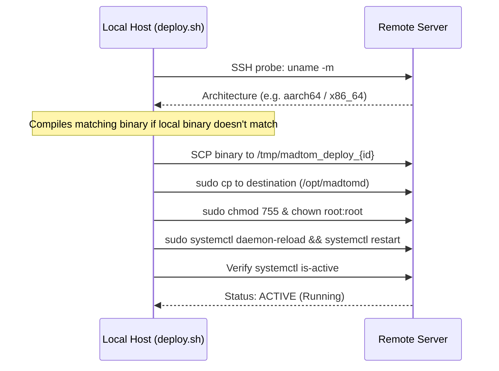

# Deployment & Systemd Service Guide

This guide describes how to deploy MADTOM daemons and collectors to remote Linux systems via SSH, configure systemd unit files, and manage background services.

---

## Table of Contents

1. [Remote SSH Deployment (`deploy.sh`)](#remote-ssh-deployment-deploysh)
   - [Workflow & Architecture](#workflow--architecture)
   - [CLI Parameters](#cli-parameters)
   - [Examples](#examples)
2. [Systemd Service Management](#systemd-service-management)
   - [`madtom-daemon.service` Configuration](#1-madtom-daemonservice)
   - [`madtom-collector.service` Configuration](#2-madtom-collectorservice)
   - [Installing & Enabling Services](#installing--enabling-services)
   - [Viewing Live Logs with `journalctl`](#viewing-live-logs-with-journalctl)
3. [Troubleshooting & Verification](#troubleshooting--verification)

---

## Remote SSH Deployment (`deploy.sh`)

The deployment script [`deploy.sh`](file:///home/danial/Programming/Projects/CSharp/MADTOM/deploy.sh) (symlinked to `MADTOM_GOLANG/deploy.sh`) automates copying binaries to remote servers, installing them to system paths with `sudo`, and restarting systemd services.

### Workflow & Architecture



### CLI Parameters

| Flag | Argument | Default | Description |
|---|---|---|---|
| `-c`, `--config` | `PATH` | *(none)* | Path to YAML configuration file for multi-host deployments (e.g. `deploy.yaml`) |
| `-u`, `--user` | `USER` | Prompted | Remote SSH username |
| `-h`, `--host` | `HOST` | Prompted | Remote hostname or IP address |
| `-p`, `--port` | `PORT` | `22` | Remote SSH port |
| `-b`, `--binary` | `PATH` | `bin/madtom-daemon` | Local executable to upload |
| `-d`, `--dest` | `PATH` | `/opt/madtomd` | Target binary path on remote machine |
| `-s`, `--service` | `NAME` | `madtomd.service` | Systemd service unit to restart (can override config defaults) |
| `-a`, `--arch` | `amd64` \| `arm64` \| `arm` \| `auto` | `auto` | Target architecture (auto-probed via SSH) |
| `--ssh-pass` | `PASS` | *(none)* | Non-interactive SSH login password |
| `--sudo-pass` | `PASS` | `--ssh-pass` | Remote sudo password (piped securely to `sudo -S`) |
| `--build` | *(none)* | Disabled | Force local compilation before deploying (reuses build across hosts) |
| `--dry-run` | *(none)* | Disabled | Validate target parameters without connecting or modifying remote systems |
| `--help` | *(none)* | *(none)* | Show usage help |

### Multi-Host Deployment via YAML (`deploy.yaml`)

To deploy to multiple servers in a single run, create a `deploy.yaml` file (excluded from git via `.gitignore`). A template is provided in [`MADTOM_GOLANG/deploy.example.yaml`](../../../MADTOM_GOLANG/deploy.example.yaml):

```bash
cp MADTOM_GOLANG/deploy.example.yaml deploy.yaml
./deploy.sh -c deploy.yaml
```

#### Configuration Schema

```yaml
# Global defaults applied to all servers unless overridden
defaults:
  user: danial
  port: 22
  service: madtomd.service
  dest: /opt/madtomd
  binary: bin/madtom-daemon
  arch: auto
  build: true
  ssh_pass: ""
  sudo_pass: ""

# Target server list
servers:
  - host: la.realiteam.art
    ssh_pass: "SECRET_SSH_PASSWORD"
    sudo_pass: "SECRET_SUDO_PASSWORD"
  - host: oc1.realiteam.art
    ssh_pass: "SECRET_SSH_PASSWORD"
    sudo_pass: "SECRET_SUDO_PASSWORD"
  - host: realiteam.art
    ssh_pass: "SECRET_SSH_PASSWORD"
    sudo_pass: "SECRET_SUDO_PASSWORD"
```

> [!NOTE]
> When `-c` is provided, `deploy.sh` iterates through each host, cross-compiles the Go binary once per required architecture, uploads via SCP, installs with `sudo`, restarts the service, and displays a deployment summary report.

### Examples

```bash
# 1. Multi-host deployment with YAML configuration
./deploy.sh -c deploy.yaml

# 2. Multi-host deployment overriding systemd service across all hosts
./deploy.sh -c deploy.yaml -s madtomd.service

# 3. Single-host non-interactive deployment with CLI passwords
./deploy.sh -u danial -h la.realiteam.art --ssh-pass secret123 --sudo-pass secret123

# 4. Interactive single-host deployment (prompts for user, host, and sudo password)
./deploy.sh

# 5. Compile for ARM64 and deploy with custom service
./deploy.sh -u danial -h 10.0.0.12 -a arm64 -s madtom-custom.service --build

# 6. Dry run validation without executing commands
./deploy.sh -c deploy.yaml --dry-run
```

---

## Systemd Service Management

Example unit files are maintained in `MADTOM_GOLANG/systemd/`.

### 1. `madtom-daemon.service`

Located at [`MADTOM_GOLANG/systemd/madtom-daemon.service`](file:///home/danial/Programming/Projects/CSharp/MADTOM/MADTOM_GOLANG/systemd/madtom-daemon.service).

```ini
[Unit]
Description=MADTOM Node Telemetry Daemon
Documentation=https://github.com/DarkDuck007/madtom
After=network.target network-online.target
Wants=network-online.target

[Service]
Type=simple
User=root
Group=root

# Recommended production invocation:
ExecStart=/opt/madtomd \
  -node-id="node-01" \
  -mode="push" \
  -collector="10.0.0.1:50051" \
  -spool-dir="/var/lib/madtomd/wal" \
  -max-spool-mb=2048 \
  -zstd=true

Restart=always
RestartSec=5s

# Security sandboxing
ProtectSystem=full
ProtectHome=read-only

[Install]
WantedBy=multi-user.target
```

---

### 2. `madtom-collector.service`

Located at [`MADTOM_GOLANG/systemd/madtom-collector.service`](file:///home/danial/Programming/Projects/CSharp/MADTOM/MADTOM_GOLANG/systemd/madtom-collector.service).

```ini
[Unit]
Description=MADTOM Telemetry Collector Hub
Documentation=https://github.com/DarkDuck007/madtom
After=network.target network-online.target
Wants=network-online.target

[Service]
Type=simple
User=root
Group=root

# Recommended production invocation:
ExecStart=/opt/madtom-collector \
  -name="Primary Hub" \
  -port=50051 \
  -data-dir="/var/lib/madtom/collector_data" \
  -reverse-push-targets="Sakura1@realiteam.art:50052,La1@la.realiteam.art:50052"

Restart=always
RestartSec=5s

[Install]
WantedBy=multi-user.target
```

---

### Installing & Enabling Services

```bash
# 1. Copy unit files to systemd directory
sudo cp MADTOM_GOLANG/systemd/madtom-daemon.service /etc/systemd/system/
sudo cp MADTOM_GOLANG/systemd/madtom-collector.service /etc/systemd/system/

# 2. Reload systemd daemon
sudo systemctl daemon-reload

# 3. Enable and start the service
sudo systemctl enable --now madtom-collector.service
# or on a monitored node:
sudo systemctl enable --now madtom-daemon.service

# 4. Check active status
systemctl status madtom-collector.service --no-pager
```

---

### Viewing Live Logs with `journalctl`

```bash
# Follow live collector logs
journalctl -u madtom-collector.service -f

# Follow live daemon logs
journalctl -u madtom-daemon.service -f

# View the last 100 log lines
journalctl -u madtom-collector.service -n 100 --no-pager
```

---

## Troubleshooting & Verification

| Issue | Likely Cause | Solution |
|---|---|---|
| `Exec format error` | Binary architecture does not match target OS (e.g. ARM binary on x86) | Re-run `./deploy.sh -a auto --build` or `./deploy.sh -a <target_arch> --build` |
| `Status: OFFLINE` on dashboard | Port `50051` or `50052` is closed, or daemon crashed | Check `journalctl -u madtomd.service -f` and verify firewall (`ufw allow 50052/tcp`) |
| `Node ID mismatch` | The name in `node-id@host:port` does not match the daemon's `-node-id` | Ensure the prefix before `@` matches the daemon's hostname or explicit `-node-id` |

