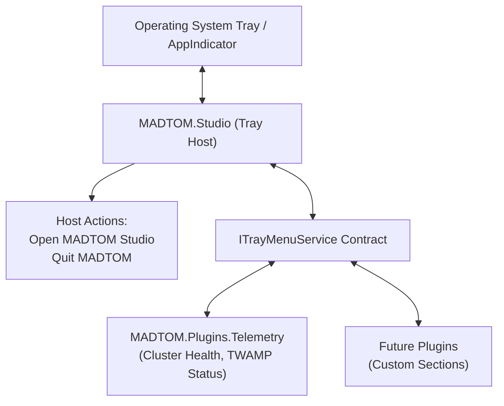
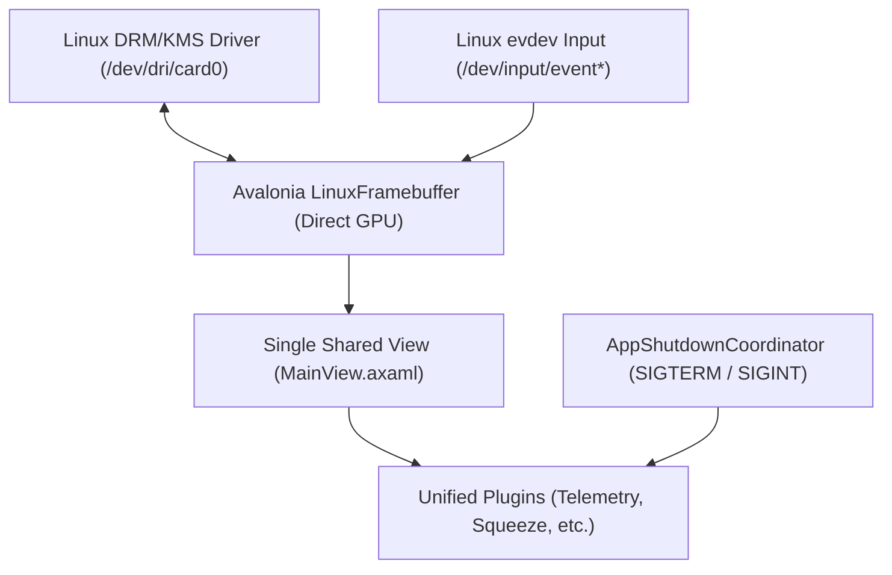

# MADTOM Studio: UI & Theming Guide

This guide covers the **MADTOM Studio** desktop host shell, dynamic layout scaling, system tray integration, runtime theme engine, lexicon dialect localization, and persistent user preferences.

---

## Table of Contents

- [Desktop UI Shell Overview](#desktop-ui-shell-overview)
  - [Executable & Launching](#executable--launching)
  - [Interactive Resizable Sidebars](#interactive-resizable-sidebars)
  - [Universal Modal Control &amp; Touchscreen Resizing](#universal-modal-control--touchscreen-resizing)
- [Settings Screen](#settings-screen)
- [Hardware Display Brightness Controls (Bare-Metal)](#hardware-display-brightness-controls-bare-metal)
- [Virtual On-Screen Keyboard (OSK)](#virtual-on-screen-keyboard-osk)
- [UI Scaling & Display Multiplier](#ui-scaling--display-multiplier)
- [System Tray & Background Execution](#system-tray--background-execution)
  - [Decoupled Architecture](#decoupled-architecture)
  - [Tray Behavior Preferences](#tray-behavior-preferences)
  - [Plugin Status Sections](#plugin-status-sections)
- [Theming & Display Contrast Profiles](#theming--display-contrast-profiles)
  - [Accessing Theme Settings](#accessing-theme-settings)
  - [14 Built-in Palettes](#14-built-in-palettes)
  - [Dynamic Theme Loading & File Watching](#dynamic-theme-loading--file-watching)
  - [Custom Theme Schema (YAML & JSON)](#custom-theme-schema-yaml--json)
- [Lexicon Dialect Localization](#lexicon-dialect-localization)
  - [Community Dialect Packs](#community-dialect-packs)
- [Direct-Display Appliance Mode (DRM/KMS)](#direct-display-appliance-mode-drmkms)
  - [Architectural Model](#architectural-model)
  - [Launching Direct-Display Mode](#launching-direct-display-mode)
  - [Systemd Appliance Service](#systemd-appliance-service)
- [Host Configuration & Persistent Storage](#host-configuration--persistent-storage)
  - [Settings File Path](#settings-file-path)
  - [Schema (`settings.json`)](#schema-settingsjson)

---

## Desktop UI Shell Overview

MADTOM Studio is a high-performance cross-platform desktop application written in **C# / .NET 10** using **Avalonia UI**. It acts as the extensible host shell for modular MADTOM plugins.

### Executable & Launching

- **Executable**: `MADTOM.Studio` (packaged in `MADTOM_DOTNET/publish/{OS_arch}/MADTOM.Studio/MADTOM.Studio`)
- **Direct Run**:
  ```bash
  # Launch the desktop studio
  dotnet run --project MADTOM_DOTNET/src/Host/MADTOM.Studio/MADTOM.Studio.csproj
  ```

### Interactive Resizable Sidebars & 3-State Cycling

The desktop shell supports interactive, draggable splitters for navigation and secondary drawers:
- Left-click and drag the vertical border divider between the navigation rail/sidebar and main view area.
- Width changes are reactive and clamp to minimum readable widths to prevent UI collapse.
- Clicking the **MADTOM Studio** logo in the header cycles through enabled navigation sidebar states:
  - **Expanded**: Full sidebar displaying module icons, titles, and categories (~220px, resizable).
  - **Compact**: Space-saving icon-only rail (64px).
  - **Hidden**: Completely hides the left navigation sidebar to maximize workspace view (0px).
- Users can choose which states are enabled for logo cycling under **Settings -> Appearance & Scaling**. At least one state is always required to remain active.

### Universal Modal Control & Touchscreen Resizing

All major dialogs and configuration windows in MADTOM Studio use the universal `UniversalModalControl` pattern:
- **Full-Screen Dimmed Backdrop**: Scrim overlay (`#C0000000`) centers the dialog and dims background clutter, matching MADTOM Telemetry's settings design.
- **Symmetric & Directional Resizing**: Edge and corner borders dynamically resize while preserving centered viewport alignment.
- **Touchscreen Support**: Touch gestures (`PointerType.Touch` and `PointerType.Pen`) are natively supported across all edges and corners with wider hit targets.
- **Tactile Corner Touch Grip**: A dedicated, prominent touch handle (`◢`) in the bottom-right corner provides an intuitive grab target for fingers on touch displays.
- **Modal Escape Key Navigation**: Pressing `Escape` or tapping the scrim (when configured) immediately dismisses the active modal dialog without saving uncommitted drafts.

---

## Settings Screen

Accessible via the gear icon (**⚙**) on the top header bar, the MADTOM Studio settings screen displays a full-screen dimmed modal organized into structured cards and tabs:
- **Appearance & Scaling**: Color theme cards with live swatch previews and category tags, UI scaling sliders and quick-preset chips, and navigation sidebar display & cycling state options.
- **Display & Brightness**: Hardware backlight controls for bare-metal / kiosk deployments (see below).
- **Persona & Lexicon**: Dialect selection (Goose, Feline, Standard).
- **System & Input**: System tray preferences, virtual on-screen keyboard controls, and application shutdown.

---

## Hardware Display Brightness Controls (Bare-Metal)

When MADTOM Studio runs directly without a desktop environment (e.g. DRM/KMS appliance mode or console Linux framebuffer), the settings dialog automatically exposes direct kernel sysfs backlight controls:
- **Multi-Monitor Support**: Automatically scans `/sys/class/backlight/` and surfaces independent brightness sliders for each attached display panel (e.g. `intel_backlight`, `card0-DP-1`).
- **Low-Brightness Safeguard**: Setting brightness below **5% of maximum** triggers a confirmation safeguard dialog (`Low Brightness Warning`) to prevent accidental screen shutoff or making the display unreadable. Confirmed settings apply to hardware; cancellations safely revert the slider.

---

## Virtual On-Screen Keyboard (OSK)

For bare-metal, touchscreen, and kiosk deployments without an OS desktop environment, MADTOM Studio provides an integrated virtual on-screen keyboard:
- **Standard US QWERTY Layout**: Full alphabet with single-tap Shift and persistent Caps Lock.
- **Symbols & Numbers (`?123`)**: Access numbers `0-9` and common punctuation.
- **Extended Symbols (`=\<`)**: Brackets, math operators, currency, and special characters.
- **Quick Networking Keys**: Dedicated one-tap keys for `@`, `/`, `.`, and `:` in the primary row for entering IP addresses, MAC addresses, URLs, and domain names without switching modes.
- **Auto-Popup & Floating Launcher**: Automatically appears when any text input field (`TextBox`) receives focus, and can be toggled manually anytime via the floating keyboard button (**⌨ OSK**) in the bottom-left corner.

---

## UI Scaling & Display Multiplier

MADTOM Studio features an app-wide layout scaling engine powered by Avalonia's `LayoutTransformControl` and `ScaleTransform`:

- **Dynamic Multiplier**: Scales all interface elements, typography, dialogs, and embedded plugin canvases from **10% (0.1×) up to 1000% (10.0×)** with pixel-accurate layout recalculation.
- **Settings Modal**: Accessible via the gear icon (**⚙**) on the top header bar.
  - **Live Scale Readout**: Displays current percentage (e.g. `100%`).
  - **Smooth Slider**: Continuous adjustment from 10% to 1000% with tick markers.
  - **Quick Preset Chips**: Fast one-click jumps to `50%`, `75%`, `100%`, `150%`, and `200%`.
  - **Reset Button**: One-click restoration back to default 100% scale.
- **Persistence**: Saved to `UiScalePercent` in `~/.local/share/MADTOM/settings.json` and restored automatically on launch.

---

## System Tray & Background Execution

MADTOM Studio includes native system tray integration designed for 24/7 background operation:



### Decoupled Architecture

- **Host Ownership**: `MADTOM.Studio` owns the tray icon lifecycle, OS tray communication, window visibility state, and top-level host menu actions (**Open MADTOM Studio** and **Quit MADTOM**).
- **Service Contract**: Plugins dynamically register contextual status sections into the tray via the host's `ITrayMenuService` contract without hardcoding UI dependencies into the host.
- **Plugin Section Attribution**: Each registered plugin section is automatically prefaced with a compact, non-intrusive header (`— {PluginName} —`) rendered in native muted/disabled color to cleanly attribute ownership across multiple loaded plugins.

### Tray Behavior Preferences

Operators configure window close/minimize behavior in the Studio Settings flyout via a dropdown:

| Option | Behavior |
|---|---|
| **Standard Window Behavior** | Clicking `X` terminates the application; minimize button minimizes to taskbar. |
| **Minimize to Tray** | Clicking `_` (minimize) hides the window to the system tray; `X` closes the app. |
| **Close to Tray** | Clicking `X` (close) hides the window to the system tray; application continues running in background. |

### Plugin Status Sections

When a plugin (such as `MADTOM.Plugins.Telemetry`) attaches to the studio:
- It contributes live cluster health, active alerts, and network telemetry directly into its designated section of the tray menu.
- Clicking tray menu items can restore the window and navigate directly to the relevant view.

---

## Theming & Display Contrast Profiles

MADTOM Studio includes a comprehensive runtime theming engine that supports instant hot reloading and dynamic file watching for custom themes.

### Accessing Theme Settings

1. Click the gear icon (**⚙**) on the top-left navigation bar.
2. Select the **Themes** dropdown.
3. Choose from built-in themes or drop custom theme files into `~/.local/share/MADTOM/themes/`.

### 14 Built-in Palettes

The studio ships with 14 handcrafted themes categorized by lighting and contrast:

| Theme Name | Style / Purpose | Base Tone |
|---|---|---|
| **Default Dark** | Default deep slate UI with clean contrast | `#070a12` |
| **Neon Glass** | Vibrant cyberpunk cyan and magenta accents | `#080c42` |
| **Cyberpunk High Contrast**| High-contrast electric teal and neon mint palette | `#031716` |
| **High Contrast** | Accessibility-focused black/white high-visibility palette | `#000000` |
| **Solarized Dark** | Classic low-contrast Ethan Schoonover palette | `#002b36` |
| **Velvet Plum Dark** | Luxurious deep midnight plum and soft rose cream tones | `#150016` |
| **Anti-Bleed Grey** | Neutral matte grey eliminating eye strain in dark rooms | `#23272e` |
| **TFT Amber Terminal** | Retro monochrome phosphor amber CRT display | `#1b1c18` |
| **Delulu** | Soft pastel aesthetic with lavender and blush tones | `#241829` |
| **Minimal Mono** | Stark greyscale typography with zero color noise | `#121214` |
| **Paper White** | Warm sepia daytime document reading palette | `#fbf9f5` |
| **Pure Light** | Clean daylight minimal white interface | `#f8fafc` |
| **Lilac Blossom Light** | Soft daylight blush, lilac, and deep purple interface | `#faf5f8` |
| **Lavender Mist** | Crisp, calming daytime lavender palette with rich contrast | `#f8f6fc` |

### Dynamic Theme Loading & File Watching

MADTOM Studio automatically watches `~/.local/share/MADTOM/themes/` at runtime:
- Dropping a `.json` or `.yaml` theme file into the folder immediately registers it in the dropdown.
- Editing an active theme file updates the UI instantly without restarting the application.
- Invalid syntax is rejected safely in memory without crashing the studio.

### Custom Theme Schema (YAML & JSON)

Custom themes define color resources for the application canvas, sidebars, borders, cards, and text hierarchy.

#### YAML Schema Example (`~/.local/share/MADTOM/themes/custom-theme.yaml`)

```yaml
id: custom-theme
name: Custom Theme
isDark: true
colors:
  Background: "#101216"
  BackgroundSecondary: "#161920"
  Surface: "#1d212a"
  SurfaceElevated: "#242934"
  Border: "#2e3442"
  TextPrimary: "#e6edf3"
  TextSecondary: "#8b949e"
  TextMuted: "#484f58"
  Accent: "#58a6ff"
  AccentHover: "#79b8ff"
  Success: "#3fb950"
  Warning: "#d29922"
  Error: "#f85149"
```

#### JSON Schema Example (`~/.local/share/MADTOM/themes/custom-theme.json`)

```json
{
  "id": "custom-theme",
  "name": "Custom Theme",
  "isDark": true,
  "colors": {
    "Background": "#101216",
    "BackgroundSecondary": "#161920",
    "Surface": "#1d212a",
    "SurfaceElevated": "#242934",
    "Border": "#2e3442",
    "TextPrimary": "#e6edf3",
    "TextSecondary": "#8b949e",
    "TextMuted": "#484f58",
    "Accent": "#58a6ff",
    "AccentHover": "#79b8ff",
    "Success": "#3fb950",
    "Warning": "#d29922",
    "Error": "#f85149"
  }
}
```

---

## Lexicon Dialect Localization

MADTOM Studio provides a playful and flexible terminology customization system called the **Lexicon Engine**:

- **Built-in Packs**:
  - **Standard / Enterprise**: Professional infrastructure terms (`Nodes`, `Metrics`, `Collectors`, `Status`).
  - **Goose**: Waterfowl dialect (`Flock`, `Honk Health`, `Breadcrumbs`).
  - **Feline**: Cat behavior terminology (`Litter`, `Purr Rate`, `Scratching Post`).
  - **Cyberpunk**: High-tech dystopian lingo (`Decks`, `ICE`, `Synapse Load`).
- **Dynamic Updates**: Switching dialect packs instantly updates all registered view labels via Avalonia's `LocExtension` markup without requiring an application restart.

### Community Dialect Packs

Place custom `.json` lexicon packs into `~/.local/share/MADTOM/lexicons/` to add new community terminology sets.

---

## Direct-Display Appliance Mode (DRM/KMS)

MADTOM Studio can boot and run directly on Linux hardware without a desktop environment or display server (no X11, Wayland, or desktop compositor required). Direct-display mode is ideal for dedicated monitoring appliances, rackmounted touchscreens, single-board computers (such as Raspberry Pi 4/5), and kiosk displays.

### Architectural Model



- **Zero UI Duplication**: The exact same visual tree and controls (`MainView.axaml`) render seamlessly across both classic desktop windows and Linux DRM framebuffers.
- **Hardware Acceleration**: Connects directly to Linux kernel mode-setting (KMS) and Direct Rendering Manager (DRM) nodes for smooth, GPU-accelerated drawing.
- **Unified Lifecycle**: Controlled shutdown signals (`SIGTERM`, `SIGINT`, systemd stop, or in-app "Exit Studio" button) coordinate via `AppShutdownCoordinator`, ensuring TSDB WAL buffers flush and plugins dispose cleanly before process termination.
- **Capability-Aware Plugins**: Plugins adapt automatically to appliance environments. For example, system tray configuration is hidden when running without a tray host, and file transfer components offer inline path entry when native desktop file pickers are unavailable.

### Launching Direct-Display Mode

```bash
# Launch direct-display on primary GPU output
MADTOM.Studio --output drm --card /dev/dri/card0 --scaling 1.0

# Launch on secondary card with 1.5x display scaling
MADTOM.Studio --output drm --card /dev/dri/card1 --scaling 1.5
```

### Systemd Appliance Service

A production systemd unit template is provided at [`MADTOM_DOTNET/deploy/systemd/madtom-studio.service`](../../MADTOM_DOTNET/deploy/systemd/madtom-studio.service).

#### Hardware & Permission Requirements
The executing user must belong to the `video`, `render`, `input`, and `tty` groups:
```bash
sudo usermod -a -G video,render,input,tty madtom
```

#### Service Installation
```bash
sudo cp MADTOM_DOTNET/deploy/systemd/madtom-studio.service /etc/systemd/system/
sudo systemctl daemon-reload
sudo systemctl enable --now madtom-studio.service
```

---

## Host Configuration & Persistent Storage

### Settings File Path

All host-level preferences persist to disk under the user's standard XDG data directory:
```bash
~/.local/share/MADTOM/settings.json
```

### Schema (`settings.json`)

```json
{
  "Theme": "default-dark",
  "Language": "goose",
  "UiScalePercent": 100,
  "CloseToTray": true,
  "MinimizeToTray": false,
  "ShowTrayIcon": true,
  "ConsoleSidebarState": 0,
  "EnableSidebarExpandedState": true,
  "EnableSidebarCollapsedState": true,
  "EnableSidebarHiddenState": true
}
```

For information on developing and integrating plugins with MADTOM Studio, see the [Plugin Architecture Guide](plugin-architecture.md).
