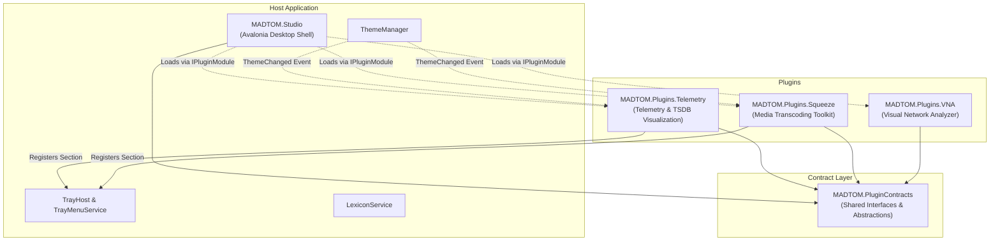
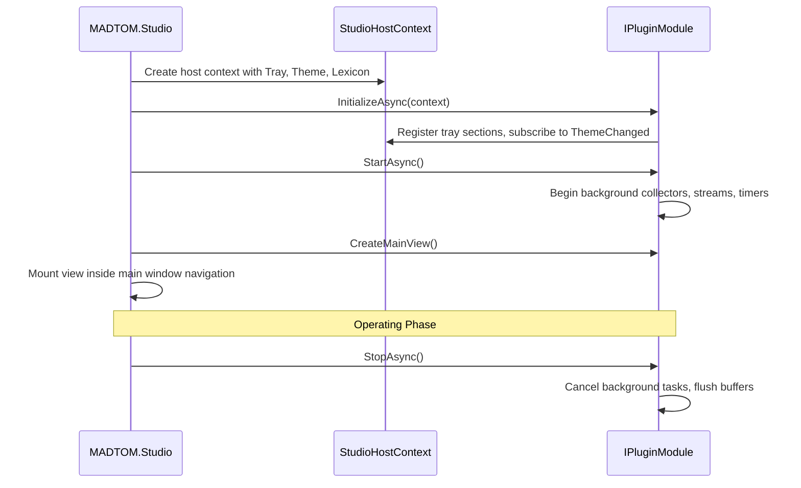

# MADTOM Studio: Plugin Architecture Guide

This document defines the architecture, service contracts, and lifecycle patterns for building and hosting plugins in **MADTOM Studio**.

---

## Table of Contents

- [Architectural Overview](#architectural-overview)
- [The Plugin Contract Layer (`MADTOM.PluginContracts`)](#the-plugin-contract-layer-madtomplugincontracts)
  - [`IPluginModule`](#ipluginmodule)
  - [`IPluginHostContext`](#ipluginhostcontext)
- [Host Services Available to Plugins](#host-services-available-to-plugins)
  - [System Tray Integration (`ITrayMenuService`)](#system-tray-integration-itraymenuservice)
  - [Dynamic Theming (`IThemeHost`)](#dynamic-theming-ithemehost)
  - [Lexicon & Localization (`ILexiconHost`)](#lexicon--localization-ilexiconhost)
  - [Desktop Notifications (`IPluginNotificationService`)](#desktop-notifications-ipluginnotificationservice)
- [Plugin Lifecycle & Execution Flow](#plugin-lifecycle--execution-flow)
- [Step-by-Step: Creating a New Plugin](#step-by-step-creating-a-new-plugin)
  - [1. Project Setup](#1-project-setup)
  - [2. Implement `IPluginModule`](#2-implement-ipluginmodule)
  - [3. Register Custom System Tray Section](#3-register-custom-system-tray-section)
  - [4. Add to Solution & Host](#4-add-to-solution--host)

---

## Architectural Overview

MADTOM Studio is designed as a modular host application. The core studio shell provides the desktop window, layout scaling, application-level system tray integration, theme management, and lexicon dialect switching.

Specific features (such as distributed telemetry, container monitoring, media transcoding, network diagnostics, or log aggregation) live entirely within separate, decoupled plugin assemblies.



---

## The Plugin Contract Layer (`MADTOM.PluginContracts`)

The `MADTOM.PluginContracts` assembly contains lightweight, zero-dependency interfaces that define the communication boundary between the host studio and plugins.

### `IPluginModule`

Every plugin entry point implements `IPluginModule`:

```csharp
namespace MADTOM.PluginContracts;

public interface IPluginModule
{
    string Id { get; }
    string DisplayName { get; }
    string Version { get; }
    string Description { get; }
    object? Icon { get; }

    Task InitializeAsync(IPluginHostContext context, CancellationToken cancellationToken = default);
    Task StartAsync(CancellationToken cancellationToken = default);
    Task StopAsync(CancellationToken cancellationToken = default);

    object CreateMainView();
}
```

### `IPluginHostContext`

During initialization, the host passes an `IPluginHostContext` instance to the plugin:

```csharp
namespace MADTOM.PluginContracts;

public interface IPluginHostContext
{
    IThemeHost Theme { get; }
    ILexiconHost Lexicon { get; }
    ITrayMenuService? Tray { get; }
    IPluginNotificationService Notifications { get; }
    string StorageDirectory { get; }
}
```

- **`Theme`**: Provides current theme palette resources and raises events when the user changes themes.
- **`Lexicon`**: Resolves localized dialect strings for UI text.
- **`Tray`**: Allows the plugin to add dynamic items to the studio's system tray menu (null in headless or standalone runner contexts).
- **`Notifications`**: Dispatches toast and system notifications to the operator.
- **`StorageDirectory`**: Safe directory (`~/.local/share/MADTOM/plugins/{PluginId}/`) for isolated plugin persistence.

---

## Host Services Available to Plugins

### System Tray Integration (`ITrayMenuService`)

Plugins should never instantiate their own OS tray icons when running inside MADTOM Studio. Instead, they register dynamic sections with the host's tray menu:

```csharp
if (context.Tray != null)
{
    var mySection = new CustomTrayMenuSection("My Plugin");
    context.Tray.AddSection(mySection);
}
```

- **Automatic Section Headers**: The studio automatically inserts a compact, non-intrusive header (`— {PluginName} —`) rendered in native muted color above the plugin's items.
- **Standalone Mode Resilience**: Standalone runner applications (such as `MADTOM.Plugins.Telemetry.App`) can provide a null or dummy `ITrayMenuService` without breaking plugin code.

### Dynamic Theming (`IThemeHost`)

Plugins inherit the studio's active color palette:
- Plugin controls subscribe to theme resource keys (e.g., `DynamicResource Background`, `DynamicResource SurfaceElevated`).
- Plugins can subscribe to `context.Theme.ThemeChanged` to update non-XAML canvas drawing brushes or custom render loops.

### Lexicon & Localization (`ILexiconHost`)

Plugins register custom terms with the host lexicon system or query existing dialect terms:
```csharp
string term = context.Lexicon.GetTerm("Host.Status.Online", defaultValue: "Online");
```

### Desktop Notifications (`IPluginNotificationService`)

Plugins can emit operator notifications with severity levels (Info, Warning, Error):
```csharp
context.Notifications.ShowNotification(
    title: "High Latency Warning",
    message: "Node 'Edge-1' RTT exceeded 150ms.",
    severity: NotificationSeverity.Warning
);
```

---

## Plugin Lifecycle & Execution Flow



1. **`InitializeAsync`**: Construct services, subscribe to host events, register tray menu sections, and load local configurations.
2. **`StartAsync`**: Launch background workers, network listeners, or gRPC telemetry subscriptions.
3. **`CreateMainView`**: Instantiate the primary Avalonia `UserControl` or view model to be hosted in the studio's navigation rail.
4. **`StopAsync`**: Gracefully terminate background threads and flush pending writes before application exit.

---

## Step-by-Step: Creating a New Plugin

To add a new plugin named `MADTOM.Plugins.NetworkTools`:

### 1. Project Setup

Create a new project directory under `MADTOM_DOTNET/src/Plugins/NetworkTools/`:

```bash
mkdir -p MADTOM_DOTNET/src/Plugins/NetworkTools/MADTOM.Plugins.NetworkTools
```

In `MADTOM.Plugins.NetworkTools.csproj`:
```xml
<Project Sdk="Microsoft.NET.Sdk">
  <PropertyGroup>
    <TargetFramework>net10.0</TargetFramework>
    <Nullable>enable</Nullable>
    <ImplicitUsings>enable</ImplicitUsings>
  </PropertyGroup>

  <ItemGroup>
    <ProjectReference Include="..\..\..\Core\MADTOM.PluginContracts\MADTOM.PluginContracts.csproj" />
  </ItemGroup>

  <ItemGroup>
    <PackageReference Include="Avalonia" Version="12.1.1" />
  </ItemGroup>
</Project>
```

### 2. Implement `IPluginModule`

```csharp
using MADTOM.PluginContracts;

namespace MADTOM.Plugins.NetworkTools;

public class NetworkToolsPluginModule : IPluginModule
{
    public string Id => "network-tools";
    public string DisplayName => "Network Tools";
    public string Version => "1.0.0";
    public string Description => "Packet analysis and connectivity diagnostics.";
    public object? Icon => null;

    private IPluginHostContext? _context;

    public Task InitializeAsync(IPluginHostContext context, CancellationToken cancellationToken = default)
    {
        _context = context;
        return Task.CompletedTask;
    }

    public Task StartAsync(CancellationToken cancellationToken = default) => Task.CompletedTask;
    public Task StopAsync(CancellationToken cancellationToken = default) => Task.CompletedTask;

    public object CreateMainView() => new NetworkToolsMainView();
}
```

### 3. Register Custom System Tray Section

If your plugin provides status indicators, implement `ITrayMenuSection`:

```csharp
public class NetworkToolsTraySection : ITrayMenuSection
{
    public string Header => "Network Status";
    public IReadOnlyList<ITrayMenuItem> Items => new[]
    {
        new TrayMenuItem("Interfaces: 4 Active", isEnabled: false),
        new TrayMenuItem("Ping Gateway: 1.2ms", isEnabled: false)
    };
}
```

And register it during `InitializeAsync`:
```csharp
if (context.Tray != null)
{
    context.Tray.AddSection(new NetworkToolsTraySection());
}
```

### 4. Add to Solution & Host

1. Add the project to `MADTOM_DOTNET/MADTOM.sln` and `MADTOM.slnx` under `/src/Plugins/NetworkTools/`.
2. Add corresponding tests under `MADTOM_DOTNET/MadTOM.Tests/Plugins/NetworkTools/`.
3. Add a project reference from `MADTOM.Studio.csproj` (or configure dynamic assembly loading).
4. Add documentation under `Documentation/Plugins/NetworkTools/`.

This ensures that MADTOM remains completely modular and organized as the ecosystem of plugins grows.

