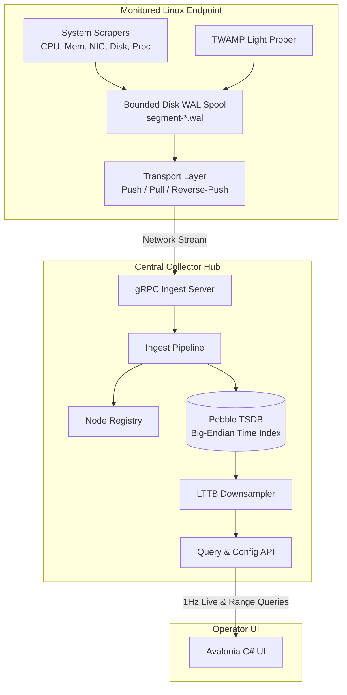

# Architecture & Protocols Reference

This document provides a technical brief on the internal architecture, transport topologies, storage mechanisms, and protocols powering MADTOM.

---

## Table of Contents

- [Architecture \& Protocols Reference](#architecture--protocols-reference)
  - [Table of Contents](#table-of-contents)
  - [High-Level Architecture](#high-level-architecture)
  - [Connection \& Ingestion Topologies](#connection--ingestion-topologies)
    - [Push Mode](#push-mode)
    - [Pull Mode](#pull-mode)
    - [Reverse-Push Mode](#reverse-push-mode)
    - [Live Subscriber Delivery](#live-subscriber-delivery)
  - [Durable Disk Spooling (WAL Engine)](#durable-disk-spooling-wal-engine)
    - [Write-Ahead Log Mechanics](#write-ahead-log-mechanics)
    - [Bounded Quotas \& Eviction](#bounded-quotas--eviction)
    - [Optional Zstandard Compression](#optional-zstandard-compression)
  - [Storage Engine (CockroachDB Pebble TSDB)](#storage-engine-cockroachdb-pebble-tsdb)
    - [Key-Value Layout](#key-value-layout)
    - [Range Scans \& Prefixes](#range-scans--prefixes)
  - [TWAMP Light Latency Measurement (RFC 5357)](#twamp-light-latency-measurement-rfc-5357)
    - [Packet Structure \& Timestamping](#packet-structure--timestamping)
    - [One-Way vs. Round-Trip Calculation](#one-way-vs-round-trip-calculation)
  - [3-Tier Metric Opt-In System \& Data Model](#3-tier-metric-opt-in-system--data-model)
    - [Opt-In Operating Modes](#opt-in-operating-modes)
    - [Swap \& Multi-Device ZRAM Storage](#swap--multi-device-zram-storage)
    - [Per-Core CPU Visualization](#per-core-cpu-visualization)

---

## High-Level Architecture

MADTOM separates telemetry collection on remote endpoints from aggregation, querying, and storage.

---

## Connection & Ingestion Topologies

MADTOM supports three transport configurations to accommodate diverse network environments:

| Pattern | Daemon Mode | Collector Mode | Typical Deployment Scenario |
|---|---|---|---|
| **Push** | `-mode push -collector IP:50051` | Default listening port (`50051`) | Standard internal networks with direct outbound route to the collector. |
| **Pull** | `-mode pull -listen-port 50052` | `-pull-targets id@IP:50052` | Internal servers where the collector actively polls nodes at 1Hz. |
| **Reverse-Push** | `-mode reverse-push -listen-port 50052` | `-reverse-push-targets id@IP:50052` | Remote nodes behind NAT/firewalls where the collector can dial in. |

### Push Mode
- Daemon establishes an outbound gRPC stream to the collector's port `50051`.
- Daemon streams batches of samples; collector acknowledges after syncing to Pebble TSDB.

### Pull Mode
- Daemon binds to port `50052`.
- Collector's `PullScraper` issues periodic gRPC `PollTelemetry` requests (default: 1-second interval) to pull buffered samples.
- Each cycle drains at most 100 batches, stopping on an empty batch or when the newest successfully ingested sample is less than one scrape interval old. Freshness uses decoded ingestion metadata for both raw and zstd payloads, including batches whose samples arrive out of timestamp order. Decoding happens once; failed ingestion does not advance the acknowledgement cursor. Each RPC has its own five-second deadline.

### Reverse-Push Mode
- Daemon binds to port `50052` in passive listening mode.
- Collector dials the remote daemon. Once the TCP channel is established, the daemon streams telemetry batches **outbound** across the established stream to the collector.

### Live Subscriber Delivery

- Each node subscription retains at most one pending live snapshot. Newer telemetry replaces an older pending snapshot, so slow clients catch up to current state instead of replaying a queue of stale display updates.
- A new subscriber immediately receives the collector's cached latest snapshot, when available. Duplicate or older timestamps do not replace that snapshot. The final unsubscribe removes the node's subscriber-list entry.
- Coalescing applies only to live display delivery. Configured stored metrics are committed before publication; WAL acknowledgements and historical storage are unchanged. A snapshot already being sent and gRPC/client buffers are outside the one-pending-snapshot bound.

---

## Durable Disk Spooling (WAL Engine)

To guarantee zero data loss during network outages, reboots, or collector downtime, `madtom-daemon` includes a built-in Write-Ahead Log:

### Write-Ahead Log Mechanics
- Every metric sample collected is appended to a local WAL file (`segment-{seq}.wal`).
- Segments remain safely on disk until an explicit `BatchAck` is received from the collector confirming persistent ingestion.
- Upon reconnection, the daemon automatically replays pending segments in sequence order.
- **In-Memory Segment Indexing**: Segment metadata and total spool capacity are maintained in-memory for $O(1)$ amortized append and eviction operations, avoiding filesystem directory scans and stat syscalls during collection ticks.
- **Offline Efficiency**: When disconnected in `PROCESS_MODE_LIVE_ONLY`, bulky process snapshots are suppressed from offline disk spooling to prevent storage and memory exhaustion, preserving standard system telemetry metrics for backlog replay. Reconnection uses exponential backoff to minimize idle CPU and network strain.

### Bounded Quotas & Eviction
- Spool capacity is bounded by `-max-spool-mb` (default: 1024 MB = 1 GB).
- If disk space exceeds the quota while offline, the oldest unacknowledged segments are evicted circular-style to protect endpoint storage without re-scanning the directory.

### Optional Zstandard Compression
- Passing `-zstd=true` on the daemon activates transparent Zstandard compression for on-disk WAL records and in-flight gRPC streams, cutting network bandwidth and disk usage by ~70%.

---

## Storage Engine (CockroachDB Pebble TSDB)

The collector uses **CockroachDB Pebble**, a high-performance embedded LSM-tree key-value store optimized for high write throughput.

### Key-Value Layout
Keys are formatted with a prefix and an 8-byte big-endian nanosecond timestamp:

$$\text{Key} = \text{NodeID} + \text{"/"} + \text{MetricName} + \text{"/"} + [\text{uint64 big-endian timestamp}]$$

Because timestamps are encoded as big-endian integers, Pebble's byte-wise lexicographical key ordering matches chronological time, enabling fast range scans.

### Range Scans & Prefixes
- Range queries execute a targeted iterator scan between `[startNano, endNano+1]`.
- Non-matching nodes or metrics are skipped via Pebble's prefix bloom filters.

---

## TWAMP Light Latency Measurement (RFC 5357)

MADTOM integrates native **TWAMP Light** (Two-Way Active Measurement Protocol) unauthenticated UDP probing:

### Packet Structure & Timestamping
- Prober sends a 44-byte UDP test packet to a TWAMP Light reflector (default UDP port 862).
- The reflector stamps its receive timestamp ($T_2$) and transmit timestamp ($T_3$) before sending the packet back to the daemon ($T_4$).

### One-Way vs. Round-Trip Calculation
- **Round-Trip Time (RTT)**:
  $$\text{RTT} = (T_4 - T_1) - (T_3 - T_2)$$
  Subtracting $(T_3 - T_2)$ eliminates the reflector's internal scheduling turnaround latency.
- **One-Way Latency**:
  - Forward: $T_2 - T_1$
  - Reverse: $T_4 - T_3$
  - Only evaluated when `-twamp-clocks-synchronized=true` is asserted and the reflector's synchronization bit is set.

---

## 3-Tier Metric Opt-In System & Data Model

To optimize endpoint resource consumption and storage scalability across large clusters, MADTOM implements a granular **3-tier opt-in telemetry model** across both the Go daemon/collector and .NET Avalonia dashboard.

### Opt-In Operating Modes

Every metric subsystem and individual hardware device (NICs, CPU cores, swap partitions, ZRAM devices, power sensors) supports three distinct operation modes:

| Mode | Enum Value | Description & Storage Semantics |
|---|---|---|
| **Off** | `0` (`OPT_IN_OFF`) | Probe is completely disabled. No CPU syscalls, no network packets, zero overhead. |
| **Monitor Only** | `1` (`OPT_IN_MONITOR_ONLY`) | Streamed live at 1 Hz over gRPC streams when an operator is actively viewing the node in the UI. **Zero disk writes**: stripped from offline WAL spool (`segment-*.wal`) and ignored by collector TSDB ingestion. |
| **Monitor & Store** | `2` (`OPT_IN_MONITOR_AND_STORE`) | Streamed live to the dashboard **and** durably committed to the collector's Pebble TSDB (and buffered in daemon WAL spool during offline disconnected periods). |

> [!IMPORTANT]
> When a daemon is offline or has no connected subscribers, `optin.StripMonitorOnlyMetrics` strips all `OPT_IN_MONITOR_ONLY` metrics before writing to the WAL spool, ensuring that offline backlog buffers only store essential metrics meant for long-term historical analysis.

### Swap & Multi-Device ZRAM Storage

To avoid redundant disk writes and eliminate counter drift:
- **Swap Partitions**: Captured from `/proc/swaps` with per-device entries (`swap.<dev>.total_bytes`, `swap.<dev>.used_bytes`).
- **Swap Optimization**: TSDB persists `swap_total` and `swap_used`. Redundant metrics like `swap_free` are never persisted to disk; they are derived on-the-fly dynamically ($\text{SwapTotal} - \text{SwapUsed}$).
- **Multi-Device ZRAM**: Supports multiple concurrent ZRAM devices (e.g. `zram0`, `zram1`) matching `zramctl`. Records `disksize_bytes` (virtual size), `mem_used_bytes` (actual memory overhead), `orig_data_bytes` (uncompressed size), and `compr_data_bytes` (compressed size). Compression ratio ($\text{orig} / \text{compr}$) is calculated dynamically and never written to TSDB.

### Per-Core CPU Visualization

- Individual per-core metrics (`cpu.core.0`, `cpu.core.1`, ..., `cpu.core.N`) are available as dedicated chart series and can be individually configured for `Off`, `Monitor Only`, or `Monitor & Store`.
- In the dashboard graph customization modal, attempting to add a metric that is currently set to `Off` on a node displays an inline opt-in prompt (`[Monitor Only]` vs. `[Monitor & Store]`), updating the node's remote daemon configuration via gRPC and adding the visual graph in a single seamless action.
