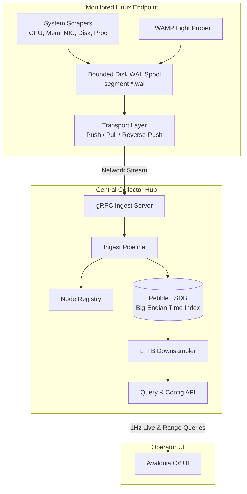

# Architecture & Protocols Reference

This document provides a technical brief on the internal architecture, transport topologies, storage mechanisms, and protocols powering MADTOM.

---

## Table of Contents

- [Architecture \& Protocols Reference](#architecture--protocols-reference)
  - [Table of Contents](#table-of-contents)
  - [High-Level Architecture](#high-level-architecture)
  - [Connection \& Ingestion Topologies](#connection--ingestion-topologies)
    - [Push Mode](#push-mode)
    - [Pull Mode](#pull-mode)
    - [Reverse-Push Mode](#reverse-push-mode)
  - [Durable Disk Spooling (WAL Engine)](#durable-disk-spooling-wal-engine)
    - [Write-Ahead Log Mechanics](#write-ahead-log-mechanics)
    - [Bounded Quotas \& Eviction](#bounded-quotas--eviction)
    - [Optional Zstandard Compression](#optional-zstandard-compression)
  - [Storage Engine (CockroachDB Pebble TSDB)](#storage-engine-cockroachdb-pebble-tsdb)
    - [Key-Value Layout](#key-value-layout)
    - [Range Scans \& Prefixes](#range-scans--prefixes)
  - [TWAMP Light Latency Measurement (RFC 5357)](#twamp-light-latency-measurement-rfc-5357)
    - [Packet Structure \& Timestamping](#packet-structure--timestamping)
    - [One-Way vs. Round-Trip Calculation](#one-way-vs-round-trip-calculation)

---

## High-Level Architecture

MADTOM separates telemetry collection on remote endpoints from aggregation, querying, and storage.

---

## Connection & Ingestion Topologies

MADTOM supports three transport configurations to accommodate diverse network environments:

| Pattern | Daemon Mode | Collector Mode | Typical Deployment Scenario |
|---|---|---|---|
| **Push** | `-mode push -collector IP:50051` | Default listening port (`50051`) | Standard internal networks with direct outbound route to the collector. |
| **Pull** | `-mode pull -listen-port 50052` | `-pull-targets id@IP:50052` | Internal servers where the collector actively polls nodes at 1Hz. |
| **Reverse-Push** | `-mode reverse-push -listen-port 50052` | `-reverse-push-targets id@IP:50052` | Remote nodes behind NAT/firewalls where the collector can dial in. |

### Push Mode
- Daemon establishes an outbound gRPC stream to the collector's port `50051`.
- Daemon streams batches of samples; collector acknowledges after syncing to Pebble TSDB.

### Pull Mode
- Daemon binds to port `50052`.
- Collector's `PullScraper` issues periodic gRPC `PollTelemetry` requests (default: 1-second interval) to pull buffered samples.

### Reverse-Push Mode
- Daemon binds to port `50052` in passive listening mode.
- Collector dials the remote daemon. Once the TCP channel is established, the daemon streams telemetry batches **outbound** across the established stream to the collector.

---

## Durable Disk Spooling (WAL Engine)

To guarantee zero data loss during network outages, reboots, or collector downtime, `madtom-daemon` includes a built-in Write-Ahead Log:

### Write-Ahead Log Mechanics
- Every metric sample collected is appended to a local WAL file (`segment-{seq}.wal`).
- Segments remain safely on disk until an explicit `BatchAck` is received from the collector confirming persistent ingestion.
- Upon reconnection, the daemon automatically replays pending segments in sequence order.

### Bounded Quotas & Eviction
- Spool capacity is bounded by `-max-spool-mb` (default: 1024 MB = 1 GB).
- If disk space exceeds the quota while offline, the oldest unacknowledged segments are evicted circular-style to protect endpoint storage.

### Optional Zstandard Compression
- Passing `-zstd=true` on the daemon activates transparent Zstandard compression for on-disk WAL records and in-flight gRPC streams, cutting network bandwidth and disk usage by ~70%.

---

## Storage Engine (CockroachDB Pebble TSDB)

The collector uses **CockroachDB Pebble**, a high-performance embedded LSM-tree key-value store optimized for high write throughput.

### Key-Value Layout
Keys are formatted with a prefix and an 8-byte big-endian nanosecond timestamp:

$$\text{Key} = \text{NodeID} + \text{"/"} + \text{MetricName} + \text{"/"} + [\text{uint64 big-endian timestamp}]$$

Because timestamps are encoded as big-endian integers, Pebble's byte-wise lexicographical key ordering matches chronological time, enabling fast range scans.

### Range Scans & Prefixes
- Range queries execute a targeted iterator scan between `[startNano, endNano+1]`.
- Non-matching nodes or metrics are skipped via Pebble's prefix bloom filters.

---

## TWAMP Light Latency Measurement (RFC 5357)

MADTOM integrates native **TWAMP Light** (Two-Way Active Measurement Protocol) unauthenticated UDP probing:

### Packet Structure & Timestamping
- Prober sends a 44-byte UDP test packet to a TWAMP Light reflector (default UDP port 862).
- The reflector stamps its receive timestamp ($T_2$) and transmit timestamp ($T_3$) before sending the packet back to the daemon ($T_4$).

### One-Way vs. Round-Trip Calculation
- **Round-Trip Time (RTT)**:
  $$\text{RTT} = (T_4 - T_1) - (T_3 - T_2)$$
  Subtracting $(T_3 - T_2)$ eliminates the reflector's internal scheduling turnaround latency.
- **One-Way Latency**:
  - Forward: $T_2 - T_1$
  - Reverse: $T_4 - T_3$
  - Only evaluated when `-twamp-clocks-synchronized=true` is asserted and the reflector's synchronization bit is set.

