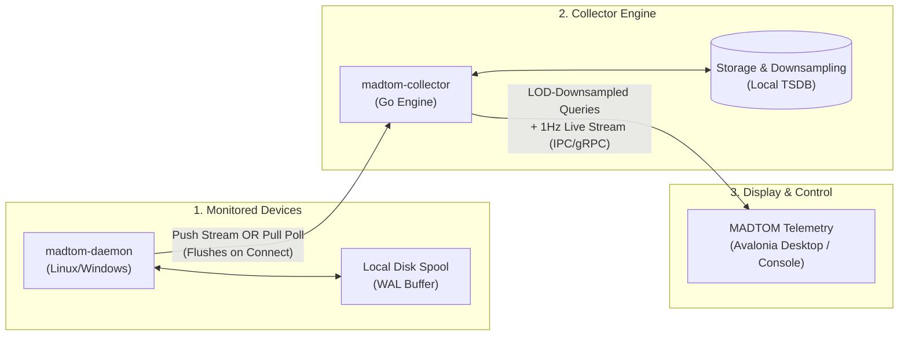
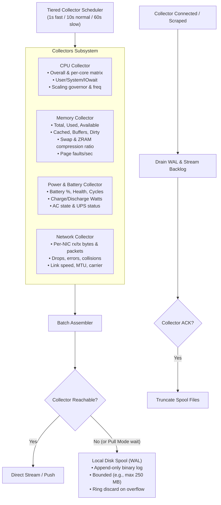
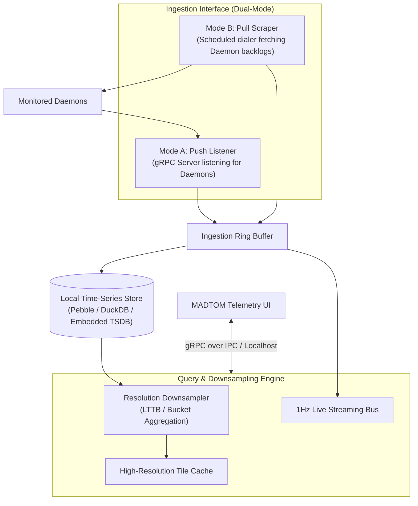
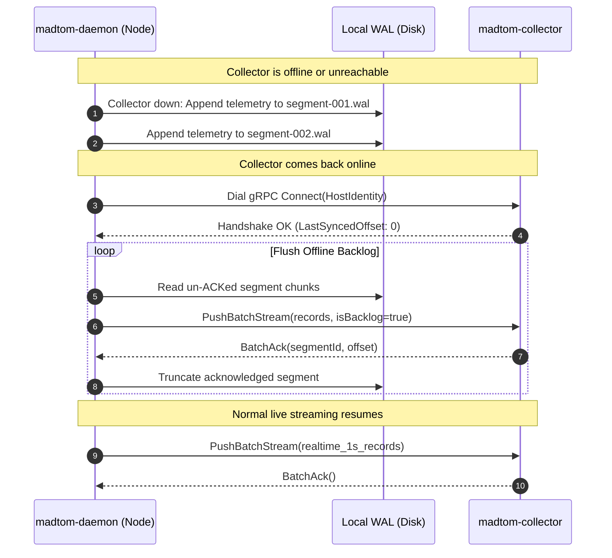
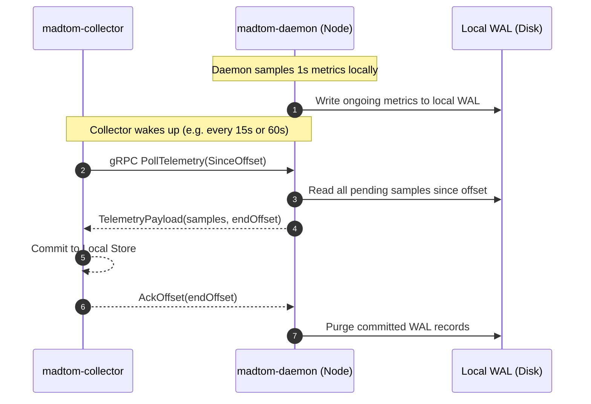
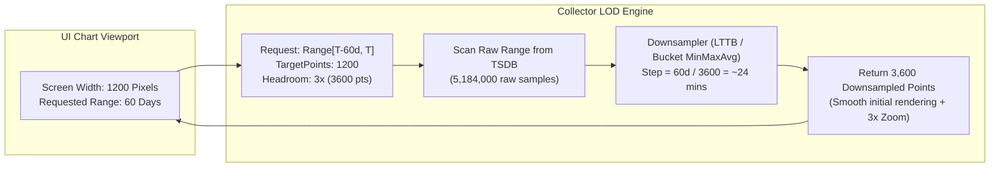
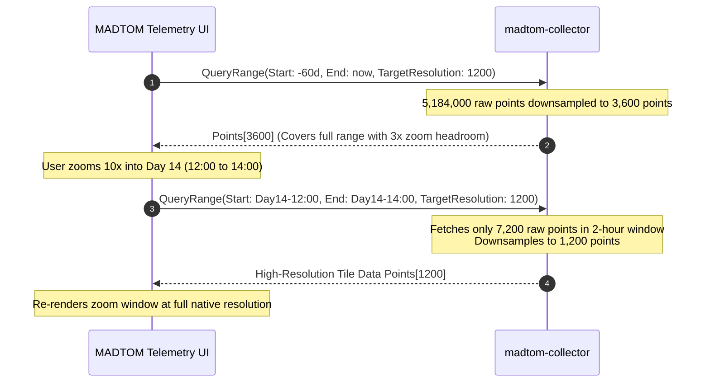
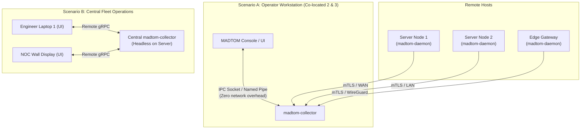

# MADTOM Telemetry: Daemon, Collector & Display Architecture

## 1. Executive Summary & Philosophy

This architecture defines a lightweight, resilient, and decoupled 3-tier telemetry pipeline tailored for MADTOM:

### Core Tenets
1. **Extreme Edge Resilience**: The monitored device is completely autonomous. If the collector is offline, down, or unreachable, metrics are committed to a bounded local disk spool. When connectivity resumes, the backlog flushes in order, then purges locally.
2. **Dual-Mode Collector (Push vs. Pull)**:
   * **Push**: Daemons establish outbound connections to the collector and stream/batch updates.
   * **Pull**: Collector periodically scrapes daemons. Between scrapes, daemons spool to disk and dump their backlog on the next poll.
3. **Data Ownership Handoff**: Once the collector acknowledges receipt of a batch, ownership transfers. The monitored daemon frees local disk space immediately.
4. **Resolution-Adaptive Queries (LOD Rendering)**: Querying 60 days of data never transfers millions of raw 1-second ticks. The collector downsamples to match the display chart's pixel budget (e.g. 1,200 points + 2x zoom headroom). Zooming triggers sub-range high-resolution fetches on the fly, identical to how PDF renderers tile high-DPI viewports.
5. **Local IPC by Default**: Components 2 (Collector) and 3 (UI) frequently live on the same physical operator workstation, talking via high-throughput localhost IPC (Unix Domain Socket or Windows Named Pipe).

---

## 2. Component 1: Monitored Node Daemon (`madtom-daemon`)

The daemon is a single Go binary running as a system service (`systemd` / Windows Service).

### Detailed Collector Metrics Specification

| Subsystem | Specific Metrics Captured | Collection Cadence |
| :--- | :--- | :--- |
| **Memory** | `MemTotal`, `MemFree`, `MemAvailable`, `Buffers`, `Cached`, `Dirty`, `Writeback`, `AnonPages`, `Mapped`, `SwapTotal`, `SwapFree`, `ZramOrigSize`, `ZramComprSize`, `ZramRatio`, `pgfault/s`, `pgmajfault/s` | Normal (5–10s) |
| **CPU** | Total utilization %, per-core utilization array (for detailed core matrix), `user`, `system`, `iowait`, `steal`, `idle`, load averages (1/5/15m), context switches/s, core frequencies | Fast (1s) |
| **Power & Battery** | AC plugged (`bool`), Battery present (`bool`), state (`Charging`, `Discharging`, `Full`), percentage, current energy (`Wh`), design capacity (`Wh`), rate (`Watts`), cycles, health % | Slow (15–30s) |
| **NICs** | Per-interface: `rx_bytes`, `tx_bytes`, `rx_packets`, `tx_packets`, `rx_dropped`, `tx_dropped`, `rx_errors`, `tx_errors`, link speed (`Mbps`), carrier (`up/down`), MTU | Fast (1s) |

### Local Disk Spooling (WAL Engine)
* **Storage Location**: `/var/spool/madtom/wal/` (Linux) or `%ProgramData%\MADTOM\spool\` (Windows).
* **Segmented Binary Files**: Rotates files every 10 MB or 10 minutes (`segment-00001.wal`).
* **Strict Bounded Quota**: Configurable hard limit (default `250 MB`). When the volume is exhausted while offline, the oldest segment is purged (FIFO) to protect host storage.
* **Drain Protocol**: When a connection to the collector succeeds, the daemon initiates a draining stream from the oldest unacknowledged segment offset.

---

## 3. Component 2: Information Collector (`madtom-collector`)

The collector is the ingestion, buffering, downsampling, and query coordinator.

### Ingestion: Mode A (Push) vs. Mode B (Pull)

#### Mode A: Push (Daemon-to-Collector Stream)

#### Mode B: Pull (Collector-Scheduled Scrape)

---

## 4. Component 3: Display Device & Resolution-Adaptive LOD Querying

The UI communicates with the collector using two primitives:
1. **Live Feed**: A continuous streaming subscription for active graphs (60 samples @ 1s resolution).
2. **Historical Range Query with Resolution Budget**: Used for overview cards, deep-dive timeline inspection, and historical scopes (1h, 24h, 7d, 60d, custom).

### The Resolution-Adaptive Downsampling Pipeline (LOD)

### On-Demand Sub-Range Zooming (PDF-Style Tiling)

---

## 5. Deployment Topology: Co-Located vs. Distributed

---

## 6. Stage-1 Implementation Roadmap (Minimal Viable Scope)

To keep the initial phase compact, functional, and verifiable, we break Stage 1 into 4 sequential steps:

```mermaid
gantt
    title Stage-1 Minimal Roadmap
    dateFormat  X
    axisFormat %d
    
    section Step 1: Protocol & Contracts
    Protobuf definitions (Metrics, Batch, SpoolHeader) :0, 2
    
    section Step 2: Monitored Node Daemon
    Linux collectors (CPU matrix, Mem+Swap/ZRAM, Power, NICs) :2, 5
    Local WAL spooler (file write, drain, purge) :4, 7
    
    section Step 3: Information Collector
    Push/Pull ingestion listener :6, 9
    Embedded disk storage & LTTB downsampler :8, 11
    
    section Step 4: UI IPC & Client
    C# Local IPC provider in MADTOM Telemetry :10, 13
    Live 1Hz streaming + adaptive range zoom verification :12, 15
```

### Deliverables by Step:

1. **Step 1: Protocol Core (`proto/madtom/v1/`)**:
   * `metrics.proto`: Memory (including swap/zram), CPU (with per-core array), Power/Battery, NIC counters.
   * `ingest.proto`: `PushBatchStream(stream Batch) returns (Ack)`, `PollTelemetry(Request) returns (Batch)`.
   * `query.proto`: `QueryRange(time_range, resolution_points) returns (SeriesData)`, `SubscribeLive(interval) returns (stream LiveSnapshot)`.

2. **Step 2: Linux Node Daemon (`agent/`)**:
   * Pure Go Linux `/proc` and `/sys` collectors (zero external dependencies).
   * Bounded directory WAL appending binary chunk files.
   * Auto-drain on connection with server ACK validation.

3. **Step 3: Information Collector (`collector/`)**:
   * Standalone Go executable (`madtom-collector`).
   * Embedded storage (Pebble key-value store or SQLite time-series tables).
   * Ingestion router supporting both Push listener and Pull scraper.
   * LTTB (Largest-Triangle-Three-Buckets) downsampling engine.

4. **Step 4: C# Telemetry Client Integration (`src/Plugins/Telemetry/`)**:
   * `CollectorIpcDataProvider`: Connects to local Unix domain socket (`/run/madtom/collector.sock`) or TCP endpoint.
   * Feeds live data into `DetailedCoreMatrixControl`, `TwampTimeSeriesChartControl`, and sparklines.
   * Connects historical time range selectors (10s, 30s, 1m, 5m, custom) to the collector's resolution-adaptive LOD query endpoint.

