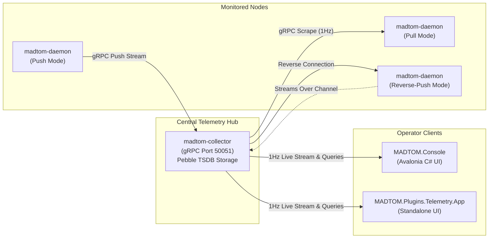

# MADTOM Telemetry & Node Management System

MADTOM is a high-performance, real-time distributed telemetry and node monitoring platform designed for Linux environments across x86_64, ARM64 (aarch64), and ARMv7 (32-bit).



---

## Documentation Index

Comprehensive guides, manuals, and technical deep-dives are organized into modular subsystems under the [`Documentation/`](Documentation/) directory:

### MADTOM Console (Host Application)
- 🖥️ **[Console UI & Theming Guide](Documentation/Console/overview-and-ui.md)**: Desktop Operator UI walkthrough, layout scaling multiplier (10% to 1000%), system tray host & menu, runtime theming engine (14 palettes, hot-reload, YAML/JSON schemas), lexicon dialect system, and `settings.json`.
- 🔌 **[Plugin Architecture Reference](Documentation/Console/plugin-architecture.md)**: Extensible plugin system contracts (`MADTOM.PluginContracts`), `IPluginModule`, `ITrayMenuService`, host context, and step-by-step guide for creating new plugins in `src/Plugins/`.

### MADTOM Telemetry Plugin
- 📊 **[Telemetry UI & Visualization Guide](Documentation/Plugins/Telemetry/ui-and-visualization.md)**: Fleet dashboard, live 1Hz sparklines, node detail, graph scopes, LTTB downsampling, process monitoring & breakdown charts, TWAMP latency radar, cache diagnostics, and configs (`graphs.json`, `collectors.json`).
- ⚙️ **[Architecture & Protocols Reference](Documentation/Plugins/Telemetry/architecture-and-protocols.md)**: Ingestion topologies (Push, Pull, Reverse-Push), Write-Ahead Log (WAL) disk spooling, CockroachDB Pebble TSDB layout, and TWAMP Light probing (RFC 5357).
- 🚀 **[Deployment & Services Guide](Documentation/Plugins/Telemetry/deployment-and-services.md)**: Remote SSH deployment automation (`deploy.sh`), architecture auto-detection, systemd units, and security sandboxing (`CAP_NET_BIND_SERVICE`).

### Scripts & CLI Tools
- 📖 **[CLI & Scripts Reference](Documentation/cli-and-scripts.md)**: Exhaustive reference of all CLI arguments, flags, scripts (`build.sh`, `publish.sh`, `deploy.sh`), and binary execution commands.

---

## Quick Start

### 1. Build All Projects Locally
```bash
# Build Go backend daemons and compile .NET solution
./build.sh

# Or build with Release optimizations & stripped symbols
./build.sh --release
```
*See [Build Script Options](Documentation/cli-and-scripts.md#1-buildsh--unified-project-build) for multi-arch cross-compilation.*

### 2. Publish Self-Contained .NET Linux App
```bash
# Publish single-file executables to MADTOM_DOTNET/publish/linux-x64/
./publish.sh

# Or cross-publish for ARM64 Linux (Raspberry Pi 4/5, AWS Graviton)
./publish.sh --arch arm64
```
*See [.NET Publishing Guide](Documentation/cli-and-scripts.md#2-publishsh--net-self-contained-linux-publishing) for RID aliases and project filters.*

For UI baselines, launch with `MADTOM_UI_TIMING=1` and summarize the captured stderr log with `python3 tools/summarize_ui_performance.py ui-performance.log`. See [capture instructions and metric definitions](Documentation/Plugins/Telemetry/ui-and-visualization.md#ui-performance-baselining).

### 3. Deploy Go Backend Daemon via SSH
```bash
# Deploys binary, auto-detects architecture (x86/ARM), installs with sudo, restarts service
./deploy.sh user@node.example.com
```
*See [Remote Deployment Guide](Documentation/Plugins/Telemetry/deployment-and-services.md#remote-ssh-deployment-deploysh) for details on staging and sudo automation.*

---

## At a Glance: Commands & Tools

### Scripts Cheat Sheet
| Script | Primary Usage | Full Reference |
|---|---|---|
| [`./build.sh`](build.sh) | Build Go daemons & .NET solution (`--release`, `--test`, `--arch`) | [Documentation](Documentation/cli-and-scripts.md#1-buildsh--unified-project-build) |
| [`./publish.sh`](publish.sh) | Self-contained single-file Linux publisher (`--arch arm64`, `--clean`) | [Documentation](Documentation/cli-and-scripts.md#2-publishsh--net-self-contained-linux-publishing) |
| [`./deploy.sh`](deploy.sh) | Remote SSH/sudo installer with auto-arch probe (`-a auto`, `--build`) | [Documentation](Documentation/Plugins/Telemetry/deployment-and-services.md#remote-ssh-deployment-deploysh) |
| [`MADTOM_GOLANG/build.sh`](MADTOM_GOLANG/build.sh) | Standalone Go compiler for `amd64`, `arm64`, and `armv7` | [Documentation](Documentation/cli-and-scripts.md#4-madtom_golangbuildsh--go-multi-architecture-compiler) |

### Executables Cheat Sheet
| Binary | Role | Full Reference |
|---|---|---|
| `madtom-daemon` | Lightweight endpoint agent (CPU, memory, disk, network, TWAMP) | [Documentation](Documentation/cli-and-scripts.md#1-madtom-daemon--node-telemetry-agent) |
| `madtom-collector` | Central gRPC telemetry hub, Pebble TSDB storage, LTTB queries | [Documentation](Documentation/cli-and-scripts.md#2-madtom-collector--central-telemetry-hub) |
| `MADTOM.Console` | Full-featured Avalonia desktop operator interface | [Documentation](Documentation/Console/overview-and-ui.md) |
| `MADTOM.Plugins.Telemetry.App` | Standalone telemetry client without console shell | [Documentation](Documentation/Plugins/Telemetry/ui-and-visualization.md#overview--standalone-mode) |

---

## Configuration & Storage Summary

All UI settings and layouts persist across application launches:

- **Host Preferences**: `~/.local/share/MADTOM/settings.json` (stores theme selection, lexicon dialect, UI scale, tray behavior).
- **Custom Themes**: `~/.local/share/MADTOM/themes/` (drop-in YAML / JSON theme definitions with live hot reload).
- **Graph Layouts**: `~/.local/share/MADTOM/graphs.json` (stores custom cards, metrics, and colors per node).
- **Graph Presets**: `~/.local/share/MADTOM/graph-presets.json` (stores named multi-graph dashboard presets).
- **Saved Collectors**: `~/.local/share/MADTOM/collectors.json` (stores configured collector hub endpoints).
- **Node Groups**: `~/.local/share/MADTOM/node-groups.json` (stores environment and custom fleet groupings).
- **Time-Series Database**: `/var/lib/madtom/collector_data` (embedded CockroachDB Pebble TSDB).

*For a complete walkthrough of configuration formats, see the [Console UI Guide](Documentation/Console/overview-and-ui.md#host-configuration--persistent-storage) and [Telemetry UI Guide](Documentation/Plugins/Telemetry/ui-and-visualization.md).*

---

## Repository Layout

```text
MADTOM/
├── build.sh                      # Root unified build script (Go + .NET)
├── publish.sh                    # Symlink to MADTOM_DOTNET/publish.sh
├── deploy.sh                     # Symlink to MADTOM_GOLANG/deploy.sh
├── README.md                     # High-level entry point & documentation index
├── Documentation/                # In-depth technical guides & manuals
│   ├── cli-and-scripts.md        # CLI flags, parameters, and executable usages
│   ├── Console/                  # MADTOM Console (Host Application)
│   │   ├── overview-and-ui.md    # UI scaling, theming engine, tray host, settings
│   │   └── plugin-architecture.md# Plugin contracts, IPluginModule, ITrayMenuService
│   └── Plugins/                  # Modular Plugin Documentation
│       └── Telemetry/            # Telemetry Plugin
│           ├── ui-and-visualization.md       # Fleet, graphs, scopes, downsampling, radar
│           ├── architecture-and-protocols.md # Topologies, WAL spooling, TSDB, TWAMP
│           └── deployment-and-services.md    # SSH deployment, staging, systemd units
│
├── MADTOM_GOLANG/                # Go Backend Services
│   ├── cmd/                      # Daemon & collector main entrypoints
│   ├── pkg/                      # TSDB, downsampling, scrapers, transports
│   ├── systemd/                  # Unit files with flag documentation
│   ├── build.sh                  # Multi-architecture Go compiler
│   └── deploy.sh                 # Remote SSH deployment script
│
└── MADTOM_DOTNET/                # .NET C# Avalonia Solution
    ├── MADTOM.sln                # Visual Studio / .NET Solution
    ├── publish.sh                # Linux self-contained publishing script
    ├── src/
    │   ├── Core/                 # Plugin contracts & interfaces (MADTOM.PluginContracts)
    │   ├── Host/MADTOM.Console/  # Main Avalonia desktop UI executable
    │   └── Plugins/Telemetry/    # Telemetry views, charts, and standalone app
    └── MadTOM.Tests/             # Unit and integration test suite
        ├── Console/              # Host settings, theming, lexicon, tray menu tests
        └── Plugins/Telemetry/    # Telemetry cache, LTTB, Zstd, metrics tests
```
